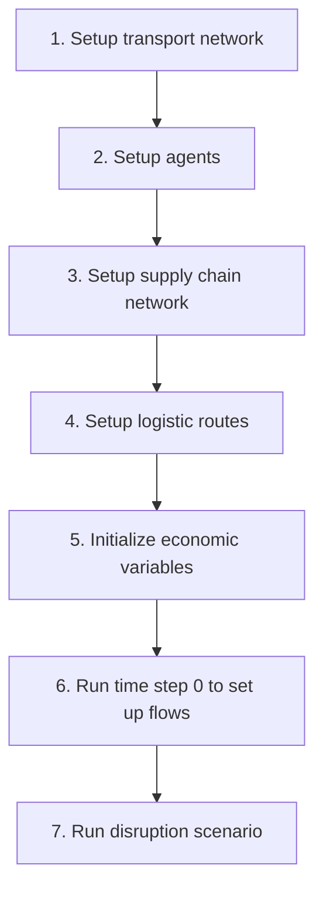

# DisruptSC

## Data Repository Setup

**Important**: This repository contains only the model code. Input data is managed separately.

### For New Users

**Step 1: Choose Data Setup Method**

Choose one of the following options to provide input data to the model:

**Option A: Git Submodule (Recommended for collaborators)**
```bash
# If you have access to the private disrupt-sc-data repository
git submodule add <disrupt-sc-data-repository-url> data
git submodule update --init
```

**Option B: Environment Variable (Flexible for different data locations)**
```bash
# Point to your local data directory
export DISRUPT_SC_DATA_PATH=/path/to/your/data/folder
```

**Option C: Local Input Folder (Simple for standalone use)**
```bash
# Create input folder and organize data by scope
mkdir input
# Copy your data files following the structure described below
```

### Data Structure

Input data should be organized by scope:
```
data/<scope>/          # or input/<scope>/ for local setup
├── Economic/           # MRIO tables, sector definitions
├── Transport/          # Infrastructure GeoJSON files
│   ├── roads_edges.geojson          # Road transport edges, LineString geometry
│   ├── maritime_edges.geojson       # Maritime transport edges, LineString geometry
│   ├── [other modes]                # Possibly other transport modes: airways, railways, waterways, pipelines
│   └── multimodal_edges.geojson     # Multimodal connections
└── Spatial/                         # Geographic disaggregation data
    ├── households.geojson           # Household location points for disaggregation
    ├── countries.geojson            # Country/import entry points  
    └── firms.geojson                # Firm spatial disaggregation data
```

### Data Path Priority

The model automatically detects data location in this order:
1. `DISRUPT_SC_DATA_PATH` environment variable (highest priority)
2. `data/` folder (git submodule)
3. `input/` folder (local fallback)


## Installation

Git clone the project

You need python. The required libraries are in the "dsc-environment.yml" file. To set the right environment, 
we recommend using an "Anaconda" or "Miniconda" distribution. Then you can create the adequate environment by doing:
	
	 conda env create -f dsc-environment.yml

Note that I observed that, in some situations, this command gets stuck in the "solving environment" step.
I think we need to define the package versions in the yml. To be updated...

### Calling the script

Activate the right environment:

	conda activate dsc

The model is launched by the following command:

	python disruptsc/main.py <scope> <optional argument>

Argument `scope` corresponds to the scope that is studied, for instance, `Tanzania`. This string should
be the same as:
- the data subfolder containing the scope's data, e.g., "data/Tanzania" (or "input/Tanzania" if using local setup).
- the suffix of the user-defined parameters yaml file in the `parameter` folder, 
e.g., "parameter/user_defined_Tanzania.yaml".
This file should be created manually by the user.

The optional argument is made to allow for some part of the initial state to be resued in a subsequent call:
- `same_transport_network_new_agents`: the transport network is reused, but new agents, supplier-buyer links, 
logistic routes are generated
- `same_agents_new_sc_network`: the transport network and the agents are reused, but new supplier-buyer links, 
logistic routes are generated
- `same_sc_network_new_logistic_routes`: the transport network, agents, supplier-buyer links, are reused, 
but new logistic routes are generated
- `same_logistic_routes`: everything is reused
The files are cached in the `tmp` folder as pickle files. Note that if you change scope, you will first need 
to call the script without optional argument.

The default parameters are defined in the "parameter/default.yaml" file. This file also defines the filepath 
to the input files. To change a parameter of filepath value, write it into the "parameter/user_defined_\<scope\>.yaml"
file.

### Data Modes

DisruptSC supports two firm data modes controlled by the `firm_data_type` parameter:

#### MRIO Mode (Default)
```yaml
firm_data_type: "mrio"  # or omit parameter entirely
```

- **Default**: Used automatically if `firm_data_type` is not specified
- **Data source**: Multi-Regional Input-Output tables
- **Households**: Generated from MRIO final demand data
- **Countries**: Generated from MRIO international trade flows
- **Supply chains**: Generated from IO technical coefficients
- **Benefits**: Comprehensive, well-tested, works with standard economic data

#### Supplier-Buyer Network Mode (Experimental)
```yaml
firm_data_type: "supplier-buyer network"
```

- **Alternative**: Requires specific transaction data files
- **Data source**: Explicit supplier-buyer transaction tables
- **Households**: Still generated from MRIO final demand
- **Countries**: Still generated from MRIO trade flows
- **Supply chains**: Generated from predefined transaction relationships
- **Required files**: `firm_table.csv`, `location_table.csv`, `transaction_table.csv`
- **Use case**: When you have detailed firm-level transaction data

**Note**: MRIO mode is recommended for most users as it provides a complete, consistent framework using standard economic data.

### Input Validation

Before running the model, validate your input files to catch errors early:

```bash
python validate_inputs.py <scope>
```

**Example:**
```bash
python validate_inputs.py Cambodia
```

**What gets validated:**
- File existence and readability
- Required columns in sector tables, MRIO data
- Data types and value ranges (no negative outputs, etc.)
- Transport network geometry (LineString required)
- MRIO table balance and structure
- Spatial file structure (households.geojson, countries.geojson, firms.geojson)
- Parameter consistency (monetary units, cutoffs)

**The validator will:**
- ✅ Show success message if all validations pass
- ❌ List specific errors that must be fixed before running the model
- ⚠️ Show warnings for deprecated files or potential issues
- 💡 Provide suggestions for fixing common problems

**Integration with model:**
The model automatically runs basic validation at startup. For comprehensive validation, use the standalone validator script.


## Concepts

### Scope

The model focuses on a country or group of countries, referred to as the "scope". 
They may be subdivided into "regions" and "subregions".

### Transport network

The transport network is a network of transport links, represented as a *networkx.Graph* object.
Multiple transport modes can be represented, such as roads, maritime, airways, waterways, pipelines, and multimodal links.

### Objects

The main objects are the economic agents. There are three classes of agents:
- firms
- households
- countries

Firms, households, and countries are associated with nodes in the transport network. 
There is at most one firm per sector per region, one household per sector per region. 
Countries are associated to nodes which are located outside the scope.

### MRIO

The structure of the model is based on a multi-regional input-output (MRIO) table.
The MRIO table defines the sectors, regions, and the interlinkages between them.

### Disaggregation

Sectors and final demand are disaggregated spatially, based on additional data given in the Spatial files.


## Inputs

### Spatial Files for MRIO Mode

The MRIO mode requires three spatial files in the `Spatial/` folder:

#### households.geojson

A GeoJSON file with *Point* geometries for household disaggregation.

Required attributes:
- `region`: Region identifier matching MRIO table
- `geometry`: Point geometry for household location
- `population` (optional): Population data per location

Example:
```json
{
  "type": "Feature",
  "properties": {
    "region": "REG01",
    "population": 15000
  },
  "geometry": {
    "type": "Point",
    "coordinates": [-45.1563, 0.4865]
  }
}
```

#### countries.geojson

A GeoJSON file with *Point* geometries for country/import entry points.

Required attributes:
- `region`: Country identifier matching MRIO external regions
- `geometry`: Point geometry for entry/exit points

Example:
```json
{
  "type": "Feature", 
  "properties": {
    "region": "CHN"
  },
  "geometry": {
    "type": "Point",
    "coordinates": [-45.2000, 0.5000]
  }
}
```

#### firms.geojson

A GeoJSON file with *Point* geometries for firm spatial disaggregation.

Required attributes:
- `region`: Region identifier matching MRIO table
- `geometry`: Point geometry for firm locations
- `<sector_name>`: One column per sector with importance/weights for disaggregation

Example firms.geojson structure:

| region | AGR | MAN | SER | geometry |
|--------|-----|-----|-----|----------|
| REG01  | 150 | 85  | 200 | Point(-45.1, 0.4) |
| REG02  | 75  | 120 | 180 | Point(-45.3, 0.6) |

The sector columns contain importance weights that determine how firms are spatially distributed within each region. Higher values indicate areas with more economic activity for that sector.


### sector_table (CSV)

A CSV file `sector_table.csv`. One row = one region*sector. Required columns:
- `sector`: the combination of <region_code>_<sector_code>
- `type`: one of 'agriculture', 'mining', 'manufacturing', utility', 'transport', 'trade', 'service'
- `output`: the total yearly output, derived from the input-output table. 
The unit should be the same as defined in the parameter `monetary_unit_in_model`.
- `final_demand`: the total yearly final demand, derived from the input-output table. 
The unit should be the same as defined in the parameter `monetary_unit_in_model`.
- `usd_per_ton`: the average monetary value, in USD, of a ton of good. 
This value can be computed from UN COMTRADE data, in which trade flows are both reported in tons and in USD. 
Set to 0 for sectors whose type is 'utility', 'transport', 'trade', 'service'
- `share_exporting_firms`: the percentage of the firms that export per sector. 
This value can be derived from country-specific data. 
Without good data, we can simply use for instance the share of export per sector.
- `supply_data`: the attribute of the 'region_data' file 
that the model will use to disaggregate the sectoral data
- `cutoff`: the cutoff value to apply. 
We will not model any firm for this sector in regions whose supply_data is below the cutoff

Note that, when no network data are used, the model will create firms based on the geospatial economic data. To speed up computation, firms that would be too small are dropped.

Example:

sector | type | output | final_demand | usd_per_ton | share_exporting_firms | supply_data | cutoff
--- | --- | --- | ---  | ---  | --- |-------------| --- 
AFG_agriculture | agriculture | 415641365| 246213152 | 950 | 0.16 | ag_prod | 3.50E+06
... | ... | ... | ... | ... | ... | ...         | ... 


## Running a disruption scenario

In the user_defined parameters file, set _simulation_type_ to `disruption`.
In the `events` parameter, write a list of disruption events. Each disruption event is a dictionary.

There are two types of events: transport disruptions and capital destructions.

A transport disruption is defined by:
- _type_ [str]: `transport_disruption`
- _description_type_ [str]: `edge_attributes` (more are possible, to be described)
- _attribute_ [str]: the attribute of the edge.geojson file that the model will use to identify the edge to disrupt, 
  for isntance
- _value_ [list[str]]: the value of the attribute that indicates wether that an edge is disrupted or not. 
  This is a list, so multiple values can be given
- _start_time_ [int]: the time step at which the disruption starts
- _duration_ [int]: the amount of time steps the disruption lasts. After that, the edge is back to normal
 
A capital destruction is defined by:
- _type_ [str]: `- type: `capital_destruction`
- _description_type_ [str]: `region_sector_file`
- `region_sector_filepath` [str]: filepath of the CSV file describing the amount of destroyed capital in each
  region sector, e.g., "Disruption/earthquake_capital_destruction.csv" (other formats to be described)
- `unit` [str]: monetary units used in the region_sector_filepath, possible values are USD, kUSD, mUSD 
- _reconstruction_market_ [bool]: if `True`, a reconstruction market is created, and capital is rebuilt. 
  The parameters of this market is, until now, hard-coded in the model.
  If `False`, the capital is never rebuilt.
- _start_time_ [int]: the time step at which the disruption starts


## Model run

The model is launched by the following command:

	python disruptsc/main.py <scope> <optional argument>

See the section "Calling the script" for more details.

This is the general workflow of the model:



Effect of the optional argument in the model run:
- When using no optional argument, the model starts at step 1.
- When using `same_transport_network_new_agents`, the model starts at step 2.
- When using `same_agents_new_sc_network`, the model starts at step 3.
- When using `same_sc_network_new_logistic_routes`, the model starts at step 4.
- When using `same_logistic_routes`, the model starts at step 5.

Note that only step 3, setup supply chain network, is stochastic. To capture the stochasticity,
the model can be run multiple times restarting at step 3.
