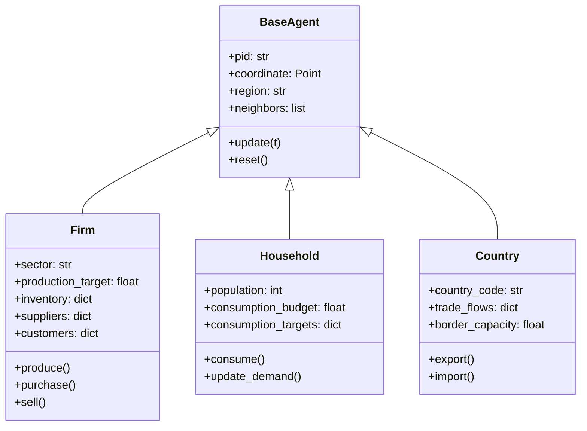
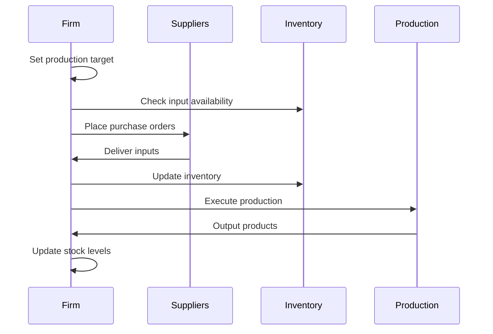
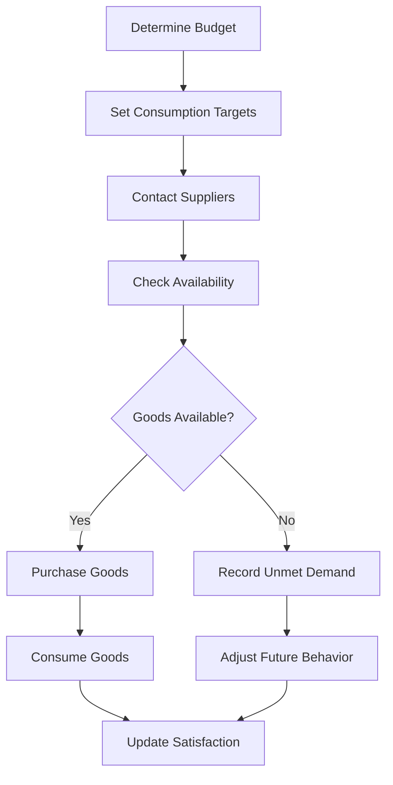
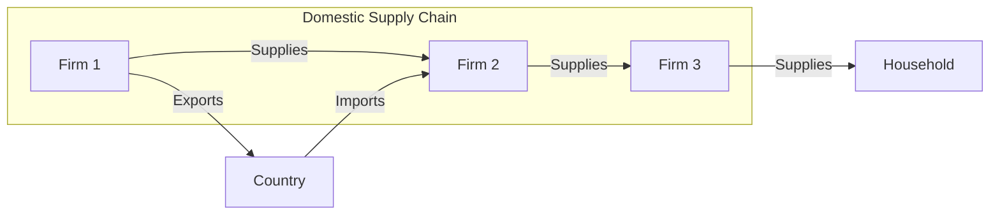

# Agent System

The agent system is the core of DisruptSC's economic modeling, representing firms, households, and countries as autonomous decision-making entities with spatial awareness and adaptive behaviors.

## Agent Architecture

### Base Agent Class

All agents inherit from `BaseAgent`, providing common functionality:

```python
class BaseAgent:
    """Base class for all economic agents."""
    
    def __init__(self, pid, coordinate, region):
        self.pid = pid                    # Unique identifier
        self.coordinate = coordinate      # Geographic location (Point)
        self.region = region             # Administrative region
        self.neighbors = []              # Spatial neighbors
        self.active = True               # Agent status
        
    def update(self, t, **kwargs):
        """Update agent state at time t."""
        pass
        
    def reset(self):
        """Reset agent to initial state."""
        pass
```

### Agent Types Overview



## Firm Agents

Firms are the primary production agents in the model, representing businesses across different sectors.

### Firm Attributes

| Attribute | Type | Description |
|-----------|------|-------------|
| `sector` | string | Region-sector code (e.g., "AGR_KHM") |
| `production_target` | float | Planned output for current period |
| `production_current` | float | Actual production achieved |
| `utilization_rate` | float | Capacity utilization (0-1) |
| `inventory` | dict | Input inventories by product type |
| `product_stock` | float | Finished goods inventory |
| `purchase_plan` | dict | Planned purchases from suppliers |
| `suppliers` | dict | Supplier relationships and weights |
| `customers` | dict | Customer relationships |
| `finance` | float | Financial position |

### Firm Behavior

#### Production Process



#### Decision Making

Firms make several key decisions each time step:

1. **Production Planning**
   ```python
   def set_production_target(self, t):
       # Base on demand forecasts and inventory levels
       target_demand = self.forecast_demand()
       inventory_adjustment = self.calculate_inventory_gap()
       self.production_target = target_demand + inventory_adjustment
   ```

2. **Supplier Selection**
   ```python
   def select_suppliers(self):
       # Choose suppliers based on:
       # - Price competitiveness
       # - Geographic proximity  
       # - Reliability/relationship strength
       # - Inventory levels
       pass
   ```

3. **Inventory Management**
   ```python
   def manage_inventory(self):
       # Maintain target inventory levels
       # Adjust for demand variability
       # Account for supply chain reliability
       pass
   ```

### Firm Types by Sector

#### Agricultural Firms
- **Characteristics**: Seasonal production, weather sensitivity, bulk products
- **Behavior**: Storage management, harvest timing, price volatility adaptation
- **Transport**: High volume, low value, time-sensitive for perishables

#### Manufacturing Firms  
- **Characteristics**: Complex supply chains, intermediate goods, scale economies
- **Behavior**: Just-in-time inventory, supplier diversification, quality control
- **Transport**: Container shipping, rail freight, supply chain coordination

#### Service Firms
- **Characteristics**: Labor-intensive, local markets, information flows
- **Behavior**: Demand responsiveness, location optimization, network effects
- **Transport**: Minimal physical goods, people movement, digital services

### Firm Component Classes

#### Inventory Management (`FirmInventoryMixin`)

```python
class FirmInventoryMixin:
    def __init__(self):
        self.inventory_targets = {}      # Target levels by product
        self.inventory_current = {}      # Current levels
        self.inventory_costs = {}        # Holding costs
        
    def calculate_inventory_gap(self, product):
        """Calculate difference between target and current inventory."""
        target = self.inventory_targets.get(product, 0)
        current = self.inventory_current.get(product, 0)
        return max(0, target - current)
        
    def update_inventory_targets(self):
        """Adaptively adjust inventory targets based on experience."""
        for product in self.inventory_targets:
            # Increase targets if frequently stocked out
            # Decrease targets if holding excess inventory
            pass
```

#### Financial Management (`FirmFinanceMixin`)

```python
class FirmFinanceMixin:
    def __init__(self):
        self.revenue = 0
        self.costs = 0
        self.profit = 0
        self.cash_flow = 0
        
    def calculate_profitability(self):
        """Calculate current period profit/loss."""
        self.profit = self.revenue - self.costs
        self.cash_flow += self.profit
        
    def can_afford_purchases(self, purchase_value):
        """Check if firm can afford planned purchases."""
        return self.cash_flow >= purchase_value
```

#### Transport Integration (`TransportMixin`)

```python
class TransportMixin:
    def __init__(self):
        self.transport_costs = {}
        self.preferred_routes = {}
        self.shipments = []
        
    def select_transport_mode(self, destination, product, volume):
        """Choose optimal transport mode based on cost and time."""
        # Consider:
        # - Product characteristics (bulk, value, urgency)
        # - Distance and available modes
        # - Cost vs time trade-offs
        pass
        
    def schedule_shipments(self):
        """Optimize shipment scheduling and consolidation."""
        pass
```

## Household Agents

Households represent final consumers and provide demand for the economic system.

### Household Attributes

| Attribute | Type | Description |
|-----------|------|-------------|
| `population` | int | Number of people represented |
| `consumption_budget` | float | Total spending capacity |
| `consumption_targets` | dict | Desired consumption by sector |
| `consumption_actual` | dict | Actual consumption achieved |
| `consumption_loss` | dict | Unmet demand by sector |
| `suppliers` | dict | Retailer relationships |

### Household Behavior

#### Consumption Process



#### Demand Formation

Households determine consumption based on:

1. **Budget Constraints**
   ```python
   def allocate_budget(self):
       # Distribute budget across sectors
       # Based on preferences and necessities
       total_budget = self.consumption_budget
       for sector in self.consumption_targets:
           share = self.consumption_shares[sector]
           self.sector_budgets[sector] = total_budget * share
   ```

2. **Price Sensitivity**
   ```python
   def adjust_for_prices(self, sector, price):
       # Reduce demand if prices increase
       elasticity = self.price_elasticities[sector]
       price_change = (price - self.reference_prices[sector]) / self.reference_prices[sector]
       demand_change = -elasticity * price_change
       self.consumption_targets[sector] *= (1 + demand_change)
   ```

3. **Availability Constraints**
   ```python
   def handle_shortages(self, sector, available_quantity):
       # Record unmet demand
       # Consider substitution possibilities
       demanded = self.consumption_targets[sector]
       shortfall = max(0, demanded - available_quantity)
       self.consumption_loss[sector] = shortfall
   ```

### Household Types

#### Urban Households
- **Characteristics**: Higher incomes, diverse consumption, service-oriented
- **Behavior**: Quality sensitivity, brand preferences, convenience focus
- **Location**: City centers, good transport access

#### Rural Households
- **Characteristics**: Lower incomes, subsistence elements, local markets
- **Behavior**: Price sensitivity, local sourcing, seasonal patterns
- **Location**: Agricultural areas, limited transport access

#### Household Spatial Behavior

Households interact with nearby suppliers based on:

- **Geographic proximity** - Travel costs and convenience
- **Market accessibility** - Transport infrastructure quality
- **Supplier diversity** - Number and type of local retailers
- **Income levels** - Ability to travel for better options

## Country Agents

Countries represent international trade partners and border/port entry points.

### Country Attributes

| Attribute | Type | Description |
|-----------|------|-------------|
| `country_code` | string | ISO country code (e.g., "CHN", "THA") |
| `import_flows` | dict | Goods imported by sector |
| `export_flows` | dict | Goods exported by sector |
| `border_capacity` | float | Trade processing capacity |
| `trade_costs` | dict | Import/export costs by mode |

### Country Behavior

#### Trade Flow Management

```python
class Country(BaseAgent):
    def process_imports(self, t):
        """Process incoming import orders."""
        for sector, orders in self.pending_imports.items():
            # Apply trade policies and restrictions
            # Calculate tariffs and processing costs
            # Schedule deliveries based on capacity
            pass
            
    def generate_exports(self, t):
        """Generate export supply based on external demand."""
        for sector in self.export_sectors:
            # External demand (outside model scope)
            # Production capacity in source country
            # Trade agreements and policies
            pass
```

#### Border Processing

Countries model border crossing and port operations:

- **Capacity constraints** - Limited processing throughput
- **Processing times** - Customs, inspection, documentation
- **Infrastructure quality** - Port efficiency, border facilities
- **Policy impacts** - Tariffs, quotas, trade agreements

## Agent Interactions

### Supplier-Buyer Relationships



### Relationship Formation

Agents form relationships based on:

1. **Geographic proximity** - Reduced transport costs
2. **Economic compatibility** - Sector input-output relationships
3. **Reliability** - Past performance and relationship strength
4. **Price competitiveness** - Cost considerations
5. **Capacity matching** - Supplier capacity vs buyer needs

### Adaptive Behavior

Agents learn and adapt over time:

#### Supplier Relationship Updates
```python
def update_supplier_weights(self, supplier_id, performance):
    """Adjust supplier relationship strength based on performance."""
    current_weight = self.suppliers[supplier_id]
    
    if performance > threshold:
        # Strengthen relationship
        new_weight = min(1.0, current_weight * 1.1)
    else:
        # Weaken relationship
        new_weight = max(0.1, current_weight * 0.9)
        
    self.suppliers[supplier_id] = new_weight
```

#### Inventory Target Adjustment
```python
def adapt_inventory_targets(self):
    """Adjust inventory targets based on recent stockout experience."""
    for product in self.inventory_targets:
        stockout_rate = self.calculate_stockout_rate(product)
        
        if stockout_rate > acceptable_threshold:
            # Increase inventory target
            self.inventory_targets[product] *= 1.2
        elif stockout_rate == 0:
            # Decrease inventory target
            self.inventory_targets[product] *= 0.95
```

## Agent Collections and Management

### Agent Containers

Agents are organized in specialized container classes:

```python
class Firms:
    """Container for all firm agents."""
    def __init__(self):
        self.firms = {}              # pid -> Firm mapping
        self.by_sector = {}          # sector -> [firms] mapping
        self.by_region = {}          # region -> [firms] mapping
        
    def update_all(self, t):
        """Update all firms in parallel."""
        for firm in self.firms.values():
            firm.update(t)
            
    def get_by_sector(self, sector):
        """Get all firms in a specific sector."""
        return self.by_sector.get(sector, [])
```

### Spatial Agent Queries

Agents support spatial queries for efficient neighbor finding:

```python
class SpatialAgentIndex:
    """Spatial index for efficient agent queries."""
    
    def __init__(self, agents):
        self.agents = agents
        self.spatial_index = self._build_spatial_index()
        
    def find_neighbors(self, agent, radius):
        """Find all agents within radius of given agent."""
        point = agent.coordinate
        candidates = self.spatial_index.intersection(
            point.buffer(radius).bounds
        )
        return [self.agents[idx] for idx in candidates]
        
    def nearest_agents(self, agent, n=5, agent_type=None):
        """Find n nearest agents of specified type."""
        distances = []
        for other in self.agents.values():
            if agent_type and not isinstance(other, agent_type):
                continue
            dist = agent.coordinate.distance(other.coordinate)
            distances.append((dist, other))
        
        distances.sort()
        return [agent for dist, agent in distances[:n]]
```

## Performance Optimization

### Agent Update Strategies

1. **Parallel Updates** - Independent agents updated simultaneously
2. **Batch Processing** - Group similar operations
3. **Lazy Evaluation** - Compute only when needed
4. **State Caching** - Cache expensive calculations

### Memory Management

```python
class MemoryEfficientAgent:
    """Base class with memory optimization."""
    
    __slots__ = ['pid', 'coordinate', 'region', '_cache']
    
    def __init__(self, pid, coordinate, region):
        self.pid = pid
        self.coordinate = coordinate
        self.region = region
        self._cache = {}
        
    def clear_cache(self):
        """Clear cached calculations to free memory."""
        self._cache.clear()
```

## Testing and Validation

### Agent Behavior Tests

```python
def test_firm_production():
    """Test firm production logic."""
    firm = Firm(pid="test_firm", sector="MAN_TEST")
    
    # Set up initial conditions
    firm.production_target = 1000
    firm.inventory = {"input_1": 500, "input_2": 300}
    
    # Execute production
    firm.produce()
    
    # Validate results
    assert firm.product_stock > 0
    assert firm.inventory["input_1"] < 500  # Inputs consumed
```

### Integration Tests

```python
def test_supply_chain_interaction():
    """Test interaction between supplier and buyer."""
    supplier = Firm(pid="supplier", sector="AGR_TEST")
    buyer = Firm(pid="buyer", sector="MAN_TEST")
    
    # Set up relationship
    buyer.add_supplier(supplier, product="AGR_TEST", weight=1.0)
    
    # Execute transaction
    buyer.place_order(supplier, product="AGR_TEST", quantity=100)
    supplier.fulfill_order(buyer, quantity=100)
    
    # Validate transaction
    assert buyer.inventory["AGR_TEST"] == 100
    assert supplier.product_stock < initial_stock
```

## Future Enhancements

### Planned Agent Features

1. **Learning Algorithms** - Machine learning for agent behavior
2. **Social Networks** - Agent-to-agent information flows
3. **Heterogeneous Agents** - More diverse agent types and behaviors
4. **Dynamic Agent Creation** - Firm entry/exit during simulation

### Advanced Behaviors

1. **Strategic Planning** - Multi-period optimization
2. **Risk Management** - Uncertainty handling and hedging
3. **Innovation** - Technology adoption and productivity growth
4. **Market Power** - Monopolistic and oligopolistic behaviors