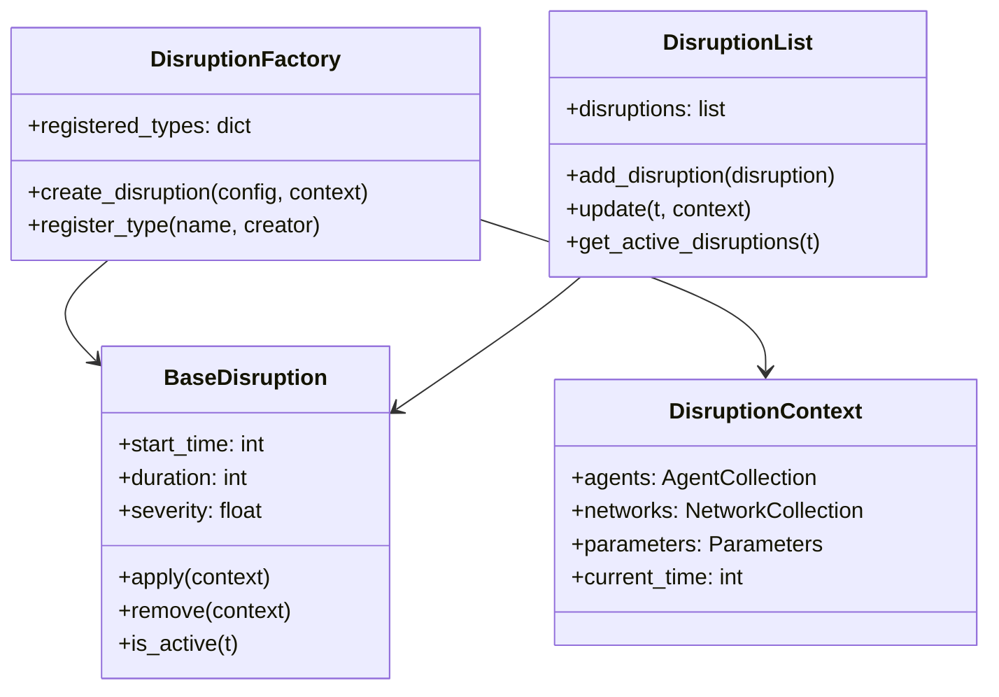

# Disruption System

The disruption system is designed to model various types of supply chain disruptions and their cascading effects through the economic and transport networks. This system uses a flexible factory pattern to support different disruption types and recovery mechanisms.

## Disruption Architecture

### Core Components



### Factory Pattern Implementation

```python
class DisruptionFactory:
    """Factory for creating disruptions from configuration."""
    
    _registered_types = {}
    
    @classmethod
    def register_disruption_type(cls, name: str, creator_func):
        """Register a new disruption type."""
        cls._registered_types[name] = creator_func
    
    @classmethod
    def create_disruption(cls, config: dict, context: DisruptionContext):
        """Create disruption from configuration."""
        disruption_type = config.get('type')
        
        if disruption_type not in cls._registered_types:
            raise ValueError(f"Unknown disruption type: {disruption_type}")
        
        creator = cls._registered_types[disruption_type]
        return creator(config, context)
    
    @classmethod
    def list_available_types(cls):
        """List all registered disruption types."""
        return list(cls._registered_types.keys())
```

## Base Disruption Class

All disruptions inherit from the `BaseDisruption` class:

```python
from abc import ABC, abstractmethod

class BaseDisruption(ABC):
    """Abstract base class for all disruption types."""
    
    def __init__(self, start_time: int, duration: int = None, **kwargs):
        self.start_time = start_time
        self.duration = duration  # None = permanent
        self.severity = kwargs.get('severity', 1.0)
        self.description = kwargs.get('description', '')
        self.affected_entities = set()
        self.original_states = {}  # Store original values for recovery
        
    def is_active(self, t: int) -> bool:
        """Check if disruption is active at time t."""
        if t < self.start_time:
            return False
        if self.duration is None:
            return True
        return t < (self.start_time + self.duration)
    
    @abstractmethod
    def apply(self, context: DisruptionContext):
        """Apply disruption effects."""
        pass
    
    @abstractmethod
    def remove(self, context: DisruptionContext):
        """Remove disruption effects (for recovery)."""
        pass
    
    def get_severity_at_time(self, t: int) -> float:
        """Get disruption severity at specific time (can vary over time)."""
        if not self.is_active(t):
            return 0.0
        return self.severity
```

## Transport Disruptions

Transport disruptions affect the physical movement of goods through the transport network.

### Edge-Based Transport Disruption

```python
class TransportDisruption(BaseDisruption):
    """Disruption affecting transport network edges."""
    
    def __init__(self, start_time: int, affected_edges: list, **kwargs):
        super().__init__(start_time, **kwargs)
        self.affected_edges = affected_edges
        self.capacity_reduction = kwargs.get('capacity_reduction', 1.0)
        self.speed_reduction = kwargs.get('speed_reduction', 0.5)
        
    def apply(self, context: DisruptionContext):
        """Apply transport disruption to network edges."""
        transport_network = context.networks.transport_network
        
        for edge_id in self.affected_edges:
            # Find edge in network
            edge_data = self._find_edge(transport_network, edge_id)
            
            if edge_data:
                # Store original values
                original_capacity = edge_data.get('capacity', float('inf'))
                original_speed = edge_data.get('max_speed', 50)
                
                self.original_states[edge_id] = {
                    'capacity': original_capacity,
                    'max_speed': original_speed
                }
                
                # Apply disruption
                new_capacity = original_capacity * (1 - self.capacity_reduction)
                new_speed = original_speed * (1 - self.speed_reduction)
                
                edge_data['capacity'] = max(0, new_capacity)
                edge_data['max_speed'] = max(1, new_speed)
                edge_data['disrupted'] = True
                
                self.affected_entities.add(edge_id)
    
    def remove(self, context: DisruptionContext):
        """Remove transport disruption (recovery)."""
        transport_network = context.networks.transport_network
        
        for edge_id in self.affected_entities:
            edge_data = self._find_edge(transport_network, edge_id)
            
            if edge_data and edge_id in self.original_states:
                # Restore original values
                original = self.original_states[edge_id]
                edge_data['capacity'] = original['capacity']
                edge_data['max_speed'] = original['max_speed']
                edge_data['disrupted'] = False
```

### Attribute-Based Transport Disruption

```python
def create_attribute_transport_disruption(config: dict, context: DisruptionContext):
    """Create transport disruption based on edge attributes."""
    
    attribute = config['attribute']
    values = config['value'] if isinstance(config['value'], list) else [config['value']]
    
    # Find all edges matching the attribute criteria
    affected_edges = []
    transport_network = context.networks.transport_network
    
    for u, v, data in transport_network.edges(data=True):
        edge_attr_value = data.get(attribute)
        if edge_attr_value in values:
            affected_edges.append((u, v))
    
    return TransportDisruption(
        start_time=config['start_time'],
        duration=config.get('duration'),
        affected_edges=affected_edges,
        capacity_reduction=config.get('capacity_reduction', 1.0),
        speed_reduction=config.get('speed_reduction', 0.5)
    )

# Register the creator function
DisruptionFactory.register_disruption_type(
    'transport_disruption', 
    create_attribute_transport_disruption
)
```

## Capital Destruction Disruptions

Capital destruction disruptions damage productive capacity of firms.

### Firm Capital Destruction

```python
class CapitalDestruction(BaseDisruption):
    """Disruption destroying firm production capacity."""
    
    def __init__(self, start_time: int, damage_data: dict, **kwargs):
        super().__init__(start_time, **kwargs)
        self.damage_data = damage_data  # {firm_id: damage_amount}
        self.reconstruction_rate = kwargs.get('reconstruction_rate', 0.1)
        self.reconstruction_market = kwargs.get('reconstruction_market', False)
        
    def apply(self, context: DisruptionContext):
        """Apply capital destruction to firms."""
        
        for firm_id, damage_amount in self.damage_data.items():
            firm = context.agents.firms.get(firm_id)
            
            if firm:
                # Store original capacity
                original_capacity = firm.production_capacity
                self.original_states[firm_id] = {
                    'production_capacity': original_capacity
                }
                
                # Apply damage
                capacity_loss = damage_amount / firm.capital_value
                new_capacity = original_capacity * (1 - capacity_loss)
                firm.production_capacity = max(0, new_capacity)
                firm.capital_damaged = damage_amount
                
                self.affected_entities.add(firm_id)
                
                # Add to reconstruction demand if enabled
                if self.reconstruction_market:
                    self._add_reconstruction_demand(firm, damage_amount, context)
    
    def _add_reconstruction_demand(self, firm, damage_amount, context):
        """Add reconstruction demand to the economy."""
        
        # Create reconstruction agent or add demand to existing construction sector
        construction_demand = {
            'requester': firm.pid,
            'amount': damage_amount,
            'timeline': int(damage_amount / (firm.production_capacity * self.reconstruction_rate)),
            'priority': 'high'
        }
        
        context.reconstruction_queue.append(construction_demand)
```

### Regional Capital Destruction

```python
def create_regional_capital_destruction(config: dict, context: DisruptionContext):
    """Create capital destruction from regional damage file."""
    
    damage_file = config['region_sector_filepath']
    damage_data = pd.read_csv(damage_file)
    
    firm_damage = {}
    
    for _, row in damage_data.iterrows():
        region_sector = row['region_sector']
        damage_amount = row['capital_destroyed']
        
        # Find firms in this region-sector
        affected_firms = context.agents.firms.get_by_sector(region_sector)
        
        # Distribute damage among firms (proportional to size)
        total_capacity = sum(firm.production_capacity for firm in affected_firms)
        
        for firm in affected_firms:
            if total_capacity > 0:
                firm_share = firm.production_capacity / total_capacity
                firm_damage[firm.pid] = damage_amount * firm_share
    
    return CapitalDestruction(
        start_time=config['start_time'],
        damage_data=firm_damage,
        reconstruction_rate=config.get('reconstruction_rate', 0.1),
        reconstruction_market=config.get('reconstruction_market', False)
    )

DisruptionFactory.register_disruption_type(
    'capital_destruction',
    create_regional_capital_destruction
)
```

## Supply Chain Disruptions

Supply chain disruptions affect commercial relationships between agents.

### Supplier Failure

```python
class SupplierFailure(BaseDisruption):
    """Disruption causing supplier to fail or reduce output."""
    
    def __init__(self, start_time: int, affected_suppliers: list, **kwargs):
        super().__init__(start_time, **kwargs)
        self.affected_suppliers = affected_suppliers
        self.output_reduction = kwargs.get('output_reduction', 1.0)
        
    def apply(self, context: DisruptionContext):
        """Apply supplier failure disruption."""
        
        for supplier_id in self.affected_suppliers:
            supplier = context.agents.firms.get(supplier_id)
            
            if supplier:
                # Store original production capacity
                original_capacity = supplier.production_capacity
                self.original_states[supplier_id] = {
                    'production_capacity': original_capacity
                }
                
                # Reduce production capacity
                new_capacity = original_capacity * (1 - self.output_reduction)
                supplier.production_capacity = new_capacity
                
                self.affected_entities.add(supplier_id)
                
                # Mark as disrupted for buyer adaptation
                supplier.disrupted = True
    
    def remove(self, context: DisruptionContext):
        """Remove supplier failure (recovery)."""
        
        for supplier_id in self.affected_entities:
            supplier = context.agents.firms.get(supplier_id)
            
            if supplier and supplier_id in self.original_states:
                # Restore original capacity
                original = self.original_states[supplier_id]
                supplier.production_capacity = original['production_capacity']
                supplier.disrupted = False
```

### Trade Restriction

```python
class TradeRestriction(BaseDisruption):
    """Disruption affecting international trade flows."""
    
    def __init__(self, start_time: int, affected_countries: list, **kwargs):
        super().__init__(start_time, **kwargs)
        self.affected_countries = affected_countries
        self.import_reduction = kwargs.get('import_reduction', 1.0)
        self.export_reduction = kwargs.get('export_reduction', 1.0)
        
    def apply(self, context: DisruptionContext):
        """Apply trade restrictions."""
        
        for country_code in self.affected_countries:
            country = context.agents.countries.get(country_code)
            
            if country:
                # Store original trade capacities
                self.original_states[country_code] = {
                    'import_capacity': country.import_capacity,
                    'export_capacity': country.export_capacity
                }
                
                # Apply restrictions
                country.import_capacity *= (1 - self.import_reduction)
                country.export_capacity *= (1 - self.export_reduction)
                
                self.affected_entities.add(country_code)
```

## Demand Shock Disruptions

Demand shocks affect household consumption patterns.

### Consumption Shock

```python
class ConsumptionShock(BaseDisruption):
    """Disruption affecting household consumption demand."""
    
    def __init__(self, start_time: int, demand_changes: dict, **kwargs):
        super().__init__(start_time, **kwargs)
        self.demand_changes = demand_changes  # {sector: change_factor}
        
    def apply(self, context: DisruptionContext):
        """Apply consumption shock to households."""
        
        for household in context.agents.households.values():
            # Store original consumption targets
            original_targets = household.consumption_targets.copy()
            self.original_states[household.pid] = {
                'consumption_targets': original_targets
            }
            
            # Apply demand changes
            for sector, change_factor in self.demand_changes.items():
                if sector in household.consumption_targets:
                    household.consumption_targets[sector] *= change_factor
            
            self.affected_entities.add(household.pid)
```

## Recovery Mechanisms

### Exponential Recovery

```python
class ExponentialRecovery:
    """Exponential recovery model for disruptions."""
    
    def __init__(self, recovery_rate: float):
        self.recovery_rate = recovery_rate  # Recovery rate per time step
        
    def calculate_recovery_factor(self, time_since_disruption: int) -> float:
        """Calculate recovery factor based on time since disruption."""
        return 1 - np.exp(-self.recovery_rate * time_since_disruption)
    
    def apply_recovery(self, disruption: BaseDisruption, t: int, context: DisruptionContext):
        """Apply gradual recovery to disruption effects."""
        
        if not disruption.is_active(t):
            return
        
        time_since_start = t - disruption.start_time
        recovery_factor = self.calculate_recovery_factor(time_since_start)
        
        # Apply partial recovery to affected entities
        for entity_id in disruption.affected_entities:
            original_state = disruption.original_states.get(entity_id, {})
            
            # Gradually restore toward original state
            self._apply_partial_restoration(entity_id, original_state, recovery_factor, context)
```

### Priority-Based Recovery

```python
class PriorityBasedRecovery:
    """Recovery system with priority-based resource allocation."""
    
    def __init__(self, recovery_resources: float):
        self.recovery_resources = recovery_resources
        self.recovery_queue = []
        
    def prioritize_recovery(self, disrupted_entities: list, context: DisruptionContext):
        """Prioritize recovery based on economic importance."""
        
        priority_scores = []
        
        for entity in disrupted_entities:
            if hasattr(entity, 'economic_importance'):
                score = entity.economic_importance
            elif hasattr(entity, 'centrality_score'):
                score = entity.centrality_score
            else:
                score = 1.0  # Default priority
            
            priority_scores.append((entity, score))
        
        # Sort by priority (highest first)
        priority_scores.sort(key=lambda x: x[1], reverse=True)
        
        return [entity for entity, score in priority_scores]
    
    def allocate_recovery_resources(self, t: int, context: DisruptionContext):
        """Allocate recovery resources to highest priority entities."""
        
        remaining_resources = self.recovery_resources
        
        for entity in self.recovery_queue:
            if remaining_resources <= 0:
                break
            
            recovery_needed = entity.calculate_recovery_requirement()
            allocated = min(remaining_resources, recovery_needed)
            
            entity.apply_recovery(allocated)
            remaining_resources -= allocated
```

## Disruption Scenarios

### Monte Carlo Disruptions

```python
class MonteCarloDisruption:
    """Generate random disruptions for Monte Carlo analysis."""
    
    def __init__(self, probability_distributions: dict):
        self.distributions = probability_distributions
        
    def generate_random_disruption(self, t: int, context: DisruptionContext):
        """Generate random disruption based on probability distributions."""
        
        # Determine if disruption occurs
        if np.random.random() > self.distributions['occurrence_probability']:
            return None
        
        # Select disruption type
        disruption_type = np.random.choice(
            list(self.distributions['types'].keys()),
            p=list(self.distributions['types'].values())
        )
        
        # Generate disruption parameters
        if disruption_type == 'transport':
            return self._generate_random_transport_disruption(t, context)
        elif disruption_type == 'capital':
            return self._generate_random_capital_disruption(t, context)
        # ... other types
    
    def _generate_random_transport_disruption(self, t: int, context: DisruptionContext):
        """Generate random transport disruption."""
        
        # Random selection of edges to disrupt
        all_edges = list(context.networks.transport_network.edges())
        n_affected = np.random.poisson(self.distributions['transport']['mean_edges'])
        affected_edges = np.random.choice(all_edges, size=min(n_affected, len(all_edges)), replace=False)
        
        # Random severity
        severity = np.random.beta(
            self.distributions['transport']['severity_alpha'],
            self.distributions['transport']['severity_beta']
        )
        
        # Random duration
        duration = np.random.exponential(self.distributions['transport']['mean_duration'])
        
        return TransportDisruption(
            start_time=t,
            duration=int(duration),
            affected_edges=affected_edges.tolist(),
            capacity_reduction=severity
        )
```

### Cascading Disruptions

```python
class CascadingDisruption:
    """Model cascading effects of disruptions."""
    
    def __init__(self, cascade_threshold: float):
        self.cascade_threshold = cascade_threshold
        self.cascaded_disruptions = []
        
    def check_cascade_conditions(self, primary_disruption: BaseDisruption, t: int, context: DisruptionContext):
        """Check if primary disruption triggers cascading effects."""
        
        affected_agents = self._get_affected_agents(primary_disruption, context)
        
        for agent in affected_agents:
            stress_level = self._calculate_stress_level(agent, context)
            
            if stress_level > self.cascade_threshold:
                # Generate secondary disruption
                secondary = self._generate_secondary_disruption(agent, stress_level, t)
                if secondary:
                    self.cascaded_disruptions.append(secondary)
    
    def _calculate_stress_level(self, agent, context: DisruptionContext) -> float:
        """Calculate stress level on agent due to disruption."""
        
        if hasattr(agent, 'calculate_supply_stress'):
            supply_stress = agent.calculate_supply_stress()
        else:
            supply_stress = 0.0
        
        if hasattr(agent, 'calculate_demand_stress'):
            demand_stress = agent.calculate_demand_stress()
        else:
            demand_stress = 0.0
        
        return max(supply_stress, demand_stress)
```

## Disruption Management

### Disruption Controller

```python
class DisruptionController:
    """Manage all disruptions during simulation."""
    
    def __init__(self, disruption_config: list):
        self.disruptions = []
        self.active_disruptions = set()
        self.recovery_system = None
        
        # Create disruptions from configuration
        for config in disruption_config:
            disruption = DisruptionFactory.create_disruption(config, None)
            self.disruptions.append(disruption)
    
    def update(self, t: int, context: DisruptionContext):
        """Update disruption states at time t."""
        
        # Check for new disruptions to activate
        for disruption in self.disruptions:
            if disruption.start_time == t and disruption not in self.active_disruptions:
                disruption.apply(context)
                self.active_disruptions.add(disruption)
                logger.info(f"Applied {type(disruption).__name__} at time {t}")
        
        # Check for disruptions to deactivate
        expired_disruptions = []
        for disruption in self.active_disruptions:
            if not disruption.is_active(t):
                disruption.remove(context)
                expired_disruptions.append(disruption)
                logger.info(f"Removed {type(disruption).__name__} at time {t}")
        
        for disruption in expired_disruptions:
            self.active_disruptions.remove(disruption)
        
        # Apply recovery mechanisms
        if self.recovery_system:
            self.recovery_system.update(t, self.active_disruptions, context)
    
    def get_disruption_summary(self) -> dict:
        """Get summary of all disruptions."""
        
        summary = {
            'total_disruptions': len(self.disruptions),
            'active_disruptions': len(self.active_disruptions),
            'by_type': {},
            'affected_entities': set()
        }
        
        for disruption in self.disruptions:
            disruption_type = type(disruption).__name__
            summary['by_type'][disruption_type] = summary['by_type'].get(disruption_type, 0) + 1
            summary['affected_entities'].update(disruption.affected_entities)
        
        return summary
```

## Performance Considerations

### Efficient Disruption Application

```python
class BatchDisruptionProcessor:
    """Process multiple disruptions efficiently."""
    
    def batch_apply_disruptions(self, disruptions: list, context: DisruptionContext):
        """Apply multiple disruptions in batches for efficiency."""
        
        # Group disruptions by type
        by_type = {}
        for disruption in disruptions:
            disruption_type = type(disruption)
            if disruption_type not in by_type:
                by_type[disruption_type] = []
            by_type[disruption_type].append(disruption)
        
        # Apply each type in batch
        for disruption_type, type_disruptions in by_type.items():
            if hasattr(disruption_type, 'batch_apply'):
                disruption_type.batch_apply(type_disruptions, context)
            else:
                # Fall back to individual application
                for disruption in type_disruptions:
                    disruption.apply(context)
```

## Testing and Validation

### Disruption Testing

```python
def test_transport_disruption():
    """Test transport disruption application and removal."""
    
    # Set up test context
    context = create_test_context()
    
    # Create disruption
    disruption = TransportDisruption(
        start_time=10,
        duration=20,
        affected_edges=[('node1', 'node2')],
        capacity_reduction=0.5
    )
    
    # Apply disruption
    original_capacity = context.networks.transport_network['node1']['node2']['capacity']
    disruption.apply(context)
    
    # Verify effects
    disrupted_capacity = context.networks.transport_network['node1']['node2']['capacity']
    assert disrupted_capacity == original_capacity * 0.5
    
    # Remove disruption
    disruption.remove(context)
    
    # Verify recovery
    recovered_capacity = context.networks.transport_network['node1']['node2']['capacity']
    assert recovered_capacity == original_capacity
```

## Future Enhancements

### Planned Disruption Features

1. **Machine Learning Disruptions** - AI-generated realistic disruption scenarios
2. **Climate Change Integration** - Weather and climate-related disruptions
3. **Cyber Security Disruptions** - Information system failures
4. **Policy Disruptions** - Regulatory and policy changes

### Advanced Recovery Models

1. **Resource-Constrained Recovery** - Limited recovery resources
2. **Learning-Based Recovery** - Improved recovery from experience
3. **Cooperative Recovery** - Multi-agent recovery coordination
4. **Resilience Investment** - Proactive resilience building