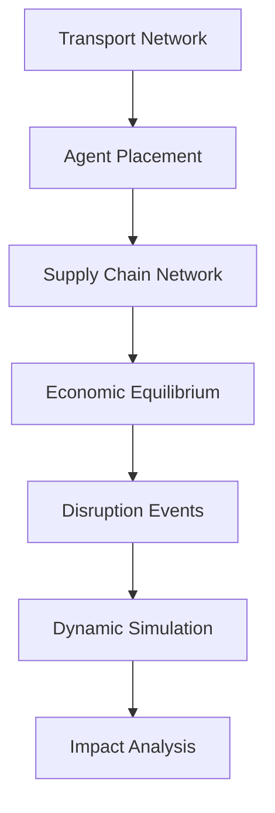

# Architecture

This section provides comprehensive technical documentation of DisruptSC's architecture, design patterns, and implementation details.

## Overview

DisruptSC is built as a modular, extensible spatial agent-based model with the following core architectural principles:

- **Modular Design** - Independent, replaceable components
- **Spatial Modeling** - Geographic awareness throughout the system
- **Network-Based** - Explicit modeling of relationships and infrastructure
- **Data-Driven** - Real-world data integration and validation
- **Event-Driven** - Disruptions and recovery as discrete events
- **Performance-Oriented** - Optimized for large-scale simulations

## Architecture Components

### [System Overview](overview.md)
Comprehensive overview of DisruptSC's architecture, design patterns, and component interactions. Covers the high-level system design, data flow, and integration patterns.

**Key Topics:**
- High-level architecture diagram
- Component relationships
- Data flow patterns
- Design patterns (Factory, Builder, Observer)
- Performance considerations
- Extension points

### [Agent System](agents.md)
Detailed documentation of the agent-based modeling system, including agent types, behaviors, and interactions.

**Key Topics:**
- Base agent architecture
- Firm agents and production modeling
- Household agents and consumption patterns
- Country agents and international trade
- Agent interactions and relationships
- Spatial agent behavior

### [Network System](networks.md)
Technical details of the network modeling system, including supply chains, transport infrastructure, and economic flows.

**Key Topics:**
- Supply chain network structure
- Transport network modeling
- Multi-regional input-output networks
- Network integration and flow allocation
- Capacity constraints and congestion
- Network disruption modeling

### [Disruption System](disruptions.md)
Architecture of the flexible disruption system, supporting various disruption types and recovery mechanisms.

**Key Topics:**
- Disruption factory pattern
- Transport disruptions
- Capital destruction modeling
- Supply chain disruptions
- Cascading effects
- Recovery mechanisms

### [Simulation Engine](simulation.md)
Core simulation engine architecture, time management, and execution control.

**Key Topics:**
- Simulation controller design
- Time management and scheduling
- Agent decision sequencing
- Market clearing mechanisms
- Data collection and state management
- Performance monitoring

## Core Concepts

### Spatial Agent-Based Modeling

DisruptSC combines two powerful modeling paradigms:

**Agent-Based Modeling (ABM)**
:   Economic actors (agents) with autonomous behaviors and interactions

**Spatial Modeling**
:   Agents are embedded in geographic space with transport networks

This combination enables realistic simulation of:
- Economic decision-making by individual actors
- Spatial constraints on trade and transport
- Network effects and cascading disruptions
- Geographic heterogeneity in impacts

### Key Components



## Agent Types

DisruptSC models three types of economic agents:

### 🏭 [Firms](agents.md#firms)
- **Role**: Producers of goods and services
- **Behavior**: Production planning, supplier selection, inventory management
- **Location**: Spatially distributed based on economic data
- **Key Attributes**: Sector, production capacity, input requirements

### 🏠 [Households](agents.md#households)  
- **Role**: Final consumers of goods and services
- **Behavior**: Consumption demand, retailer selection
- **Location**: Population-weighted spatial distribution
- **Key Attributes**: Region, consumption patterns, population

### 🌍 [Countries](agents.md#countries)
- **Role**: International trade partners
- **Behavior**: Import/export flows, transit services
- **Location**: Border points and trade gateways
- **Key Attributes**: Trade volumes, entry/exit points

## Network Structures

### [Transport Networks](networks.md#transport-networks)

Multi-modal infrastructure connecting all locations:

- **Roads** - Primary domestic transport
- **Maritime** - International and bulk transport  
- **Railways** - Freight corridors
- **Airways** - High-value goods
- **Waterways** - River and canal transport
- **Pipelines** - Energy and chemicals

### [Supply Chain Networks](networks.md#supply-chain-networks)

Commercial relationships between agents:
- **B2B Links** - Firm-to-firm transactions
- **B2C Links** - Firm-to-household sales
- **Import/Export** - International trade flows
- **Transit** - Country-to-country flows

## Model Workflow

### Initialization Phase

1. **[Transport Network Setup](networks.md#transport-setup)**
   - Load infrastructure data
   - Build network graph
   - Configure logistics parameters

2. **[Agent Creation](agents.md#agent-creation)**
   - Generate firms from economic data
   - Place households by population
   - Position countries at borders

3. **[Supply Chain Formation](networks.md#supply-chain-formation)**
   - Link buyers and suppliers
   - Assign commercial relationships
   - Configure trade parameters

4. **[Route Optimization](networks.md#route-optimization)**
   - Find optimal transport paths
   - Assign logistics costs
   - Configure capacity constraints

5. **[Economic Equilibrium](simulation.md#equilibrium)**
   - Calculate production levels
   - Set prices and flows
   - Initialize inventories

### Simulation Phase

1. **[Disruption Events](disruptions.md)**
   - Apply transport disruptions
   - Implement capital destruction
   - Trigger recovery processes

2. **[Dynamic Simulation](simulation.md#time-steps)**
   - Agent decision-making
   - Market transactions
   - Transport operations
   - Impact propagation

3. **[Data Collection](simulation.md#data-collection)**
   - Agent state tracking
   - Flow monitoring
   - Performance metrics

## Design Principles

### Modularity
- Clear separation of concerns
- Pluggable component architecture
- Flexible configuration system

### Scalability
- Efficient algorithms for large networks
- Parallel processing capabilities
- Memory-optimized data structures

### Extensibility
- Abstract base classes for new agent types
- Plugin system for disruption types
- Configurable economic behaviors

### Realism
- Based on economic theory (Input-Output)
- Realistic transport costs and times
- Empirically-calibrated parameters

## Data Flow


## Performance Characteristics

### Computational Complexity
- **Agents**: Linear scaling O(n)
- **Networks**: Depends on connectivity O(n log n to n²)
- **Time Steps**: Linear in simulation duration
- **Overall**: Suitable for regional to national scale

### Memory Requirements
- **Minimum**: 8GB RAM for small models
- **Recommended**: 16GB+ for production use
- **Large Scale**: 32GB+ for continental models

### Runtime Performance
- **Initialization**: Minutes to hours (depending on scale)
- **Simulation**: Seconds to minutes per time step
- **Caching**: Significant speedup for repeated runs

## Technology Stack

### Core Dependencies
- **Python 3.10+** - Primary language
- **NetworkX** - Graph algorithms
- **Pandas/NumPy** - Data processing
- **GeoPandas** - Spatial data handling
- **SciPy** - Scientific computing

### Optional Components
- **Matplotlib/Plotly** - Visualization
- **Jupyter** - Interactive analysis
- **Dask** - Parallel computing
- **PostGIS** - Spatial databases

## Extension Points

### Custom Agent Types
```python
from disruptsc.agents.base_agent import BaseAgent

class CustomAgent(BaseAgent):
    def __init__(self, ...):
        # Custom initialization
        pass
    
    def custom_behavior(self):
        # Agent-specific logic
        pass
```

### Custom Disruption Types
```python
from disruptsc.disruption.disruption import BaseDisruption

class CustomDisruption(BaseDisruption):
    def apply(self, model, time_step):
        # Disruption logic
        pass
```

## What's Next?

Explore the detailed architecture:

- **[Agents](agents.md)** - Economic actors and their behaviors
- **[Networks](networks.md)** - Transport and supply chain structures
- **[Disruptions](disruptions.md)** - Event modeling and recovery
- **[Simulation](simulation.md)** - Time-stepped execution and data collection