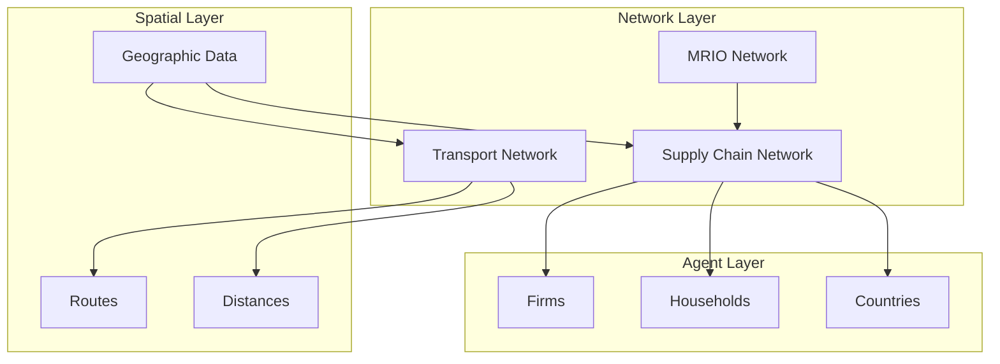

# Network System

DisruptSC models economic and physical relationships through interconnected networks. This section explains the network architecture, types, and how they interact to create realistic supply chain dynamics.

## Network Architecture Overview



The network system consists of three primary network types that interact to model supply chain dynamics:

1. **Supply Chain Network** - Commercial relationships between economic agents
2. **Transport Network** - Physical infrastructure for moving goods
3. **Multi-Regional Input-Output Network** - Sectoral economic interdependencies

## Supply Chain Network

The supply chain network models commercial relationships and flows between economic agents.

### Network Structure

```python
class ScNetwork(nx.DiGraph):
    """Supply chain network extending NetworkX DiGraph."""
    
    def __init__(self):
        super().__init__()
        self.flow_data = {}          # Edge flows by time period
        self.disruption_state = {}   # Current disruption impacts
        
    def add_commercial_link(self, supplier, buyer, product, weight):
        """Add commercial relationship between agents."""
        self.add_edge(
            supplier.pid, 
            buyer.pid,
            product=product,
            weight=weight,
            baseline_flow=0
        )
```

### Node Types

| Node Type | Description | Attributes |
|-----------|-------------|------------|
| **Firm** | Production companies | sector, region, production_capacity |
| **Household** | Final consumers | region, population, consumption_budget |
| **Country** | International traders | country_code, import_capacity |

### Edge Attributes

| Attribute | Type | Description |
|-----------|------|-------------|
| `product` | string | Product/sector being traded |
| `weight` | float | Relationship strength (0-1) |
| `baseline_flow` | float | Economic flow value |
| `transport_cost` | float | Cost of transport per unit |
| `lead_time` | int | Delivery time in time steps |
| `reliability` | float | Supplier reliability score |

### Network Formation

#### MRIO-Based Formation

For the default MRIO mode, supply chains are generated from input-output coefficients:

```python
def create_mrio_supply_chains(self, mrio, agents):
    """Create supply chain links from MRIO coefficients."""
    
    for buyer_sector in mrio.index:
        for supplier_sector in mrio.columns:
            coefficient = mrio.loc[buyer_sector, supplier_sector]
            
            if coefficient > self.io_cutoff:
                # Find agents in these sectors
                buyers = self.get_agents_by_sector(buyer_sector)
                suppliers = self.get_agents_by_sector(supplier_sector)
                
                # Create links with spatial preferences
                for buyer in buyers:
                    selected_suppliers = self.select_suppliers(
                        buyer, suppliers, coefficient
                    )
                    
                    for supplier, weight in selected_suppliers:
                        self.add_commercial_link(
                            supplier, buyer, supplier_sector, weight
                        )
```

#### Spatial Supplier Selection

Suppliers are selected based on distance preferences:

```python
def select_suppliers(self, buyer, candidates, total_demand):
    """Select suppliers with spatial preference weighting."""
    
    # Calculate distances
    distances = []
    for supplier in candidates:
        dist = buyer.coordinate.distance(supplier.coordinate)
        distances.append((supplier, dist))
    
    # Apply spatial preference
    weights = []
    for supplier, distance in distances:
        # Closer suppliers get higher weights
        spatial_weight = np.exp(-self.distance_decay * distance)
        capacity_weight = supplier.production_capacity / total_capacity
        final_weight = spatial_weight * capacity_weight
        weights.append((supplier, final_weight))
    
    # Normalize and select top suppliers
    return self.normalize_and_select(weights, self.max_suppliers)
```

#### Network-Based Formation

For supplier-buyer network mode, relationships are explicitly defined:

```python
def create_network_supply_chains(self, transaction_table):
    """Create supply chains from explicit transaction data."""
    
    for _, row in transaction_table.iterrows():
        supplier = self.agents[row['supplier_id']]
        buyer = self.agents[row['buyer_id']]
        product = row['product_sector']
        value = row['transaction']
        
        weight = self.calculate_relationship_weight(value, buyer.total_inputs)
        
        self.add_commercial_link(supplier, buyer, product, weight)
```

### Network Metrics

The supply chain network supports various analysis metrics:

```python
class NetworkAnalyzer:
    """Analyze supply chain network properties."""
    
    def calculate_centrality(self, network):
        """Calculate various centrality measures."""
        return {
            'betweenness': nx.betweenness_centrality(network),
            'degree': dict(network.degree()),
            'eigenvector': nx.eigenvector_centrality(network),
            'pagerank': nx.pagerank(network)
        }
    
    def find_critical_nodes(self, network, top_n=10):
        """Identify most critical nodes for network connectivity."""
        centrality = nx.betweenness_centrality(network)
        return sorted(centrality.items(), key=lambda x: x[1], reverse=True)[:top_n]
    
    def analyze_clustering(self, network):
        """Analyze network clustering and community structure."""
        return {
            'clustering_coefficient': nx.average_clustering(network),
            'communities': nx.community.greedy_modularity_communities(network)
        }
```

## Transport Network

The transport network models physical infrastructure used to move goods between locations.

### Network Structure

```python
class TransportNetwork(nx.MultiGraph):
    """Transport network with multiple transport modes."""
    
    def __init__(self):
        super().__init__()
        self.modes = ['roads', 'maritime', 'railways', 'airways']
        self.node_spatial_index = None
        self.route_cache = {}
        
    def add_transport_edge(self, from_node, to_node, mode, **attributes):
        """Add transport link between nodes."""
        self.add_edge(
            from_node,
            to_node,
            mode=mode,
            **attributes
        )
```

### Transport Modes

#### Road Network
- **Primary use**: Domestic freight and passenger transport
- **Characteristics**: Flexible routing, door-to-door delivery
- **Capacity**: Vehicle-based, congestion-sensitive

```python
def load_road_network(self, roads_geojson):
    """Load road network from GeoJSON file."""
    roads = gpd.read_file(roads_geojson)
    
    for _, road in roads.iterrows():
        from_node, to_node = self.extract_endpoints(road.geometry)
        
        self.add_edge(
            from_node, to_node,
            mode='roads',
            highway=road.highway,
            length_km=road.length_km,
            max_speed=road.get('max_speed', 50),
            capacity=road.get('capacity', 1000)
        )
```

#### Maritime Network
- **Primary use**: International trade, bulk goods
- **Characteristics**: High capacity, slow speed, port-to-port
- **Infrastructure**: Ports, shipping lanes

```python
def load_maritime_network(self, maritime_geojson):
    """Load maritime routes and port connections."""
    routes = gpd.read_file(maritime_geojson)
    
    for _, route in routes.iterrows():
        from_port, to_port = self.extract_ports(route.geometry)
        
        self.add_edge(
            from_port, to_port,
            mode='maritime',
            route_type=route.route_type,
            length_km=route.length_km,
            typical_speed=route.get('speed_kmh', 25),
            port_from=route.port_from,
            port_to=route.port_to
        )
```

#### Railway Network
- **Primary use**: Bulk freight, medium-distance passenger
- **Characteristics**: Fixed routes, high capacity, energy efficient
- **Infrastructure**: Rail lines, stations, terminals

#### Multimodal Connections
- **Purpose**: Connect different transport modes
- **Examples**: Port-to-road, rail-to-road, airport connections
- **Attributes**: Transfer time, handling costs

### Network Construction

#### Spatial Network Creation

```python
def build_spatial_network(self, geojson_files):
    """Build integrated transport network from spatial data."""
    
    # Load all transport modes
    for mode, filepath in geojson_files.items():
        if os.path.exists(filepath):
            self.load_transport_mode(mode, filepath)
    
    # Create spatial index for efficient queries
    self.build_spatial_index()
    
    # Connect different modes at transfer points
    self.create_multimodal_connections()
    
    # Validate network connectivity
    self.validate_connectivity()
```

#### Network Validation

```python
def validate_connectivity(self):
    """Ensure transport network is properly connected."""
    
    # Check each mode separately
    for mode in self.modes:
        mode_edges = [(u, v) for u, v, d in self.edges(data=True) if d['mode'] == mode]
        mode_graph = nx.Graph(mode_edges)
        
        if not nx.is_connected(mode_graph):
            components = list(nx.connected_components(mode_graph))
            logger.warning(f"{mode} network has {len(components)} disconnected components")
    
    # Check overall connectivity
    if not nx.is_connected(self):
        logger.error("Transport network is not fully connected")
        raise NetworkValidationError("Disconnected transport network")
```

### Routing and Path Finding

#### Shortest Path Calculation

```python
class TransportRouter:
    """Handle routing calculations on transport network."""
    
    def __init__(self, transport_network):
        self.network = transport_network
        self.route_cache = {}
        
    def find_shortest_path(self, origin, destination, criteria='time'):
        """Find optimal path between two points."""
        
        # Check cache first
        cache_key = (origin, destination, criteria)
        if cache_key in self.route_cache:
            return self.route_cache[cache_key]
        
        # Calculate shortest path
        if criteria == 'time':
            weight_func = self.calculate_travel_time
        elif criteria == 'cost':
            weight_func = self.calculate_transport_cost
        elif criteria == 'distance':
            weight_func = lambda u, v, d: d.get('length_km', 0)
        
        try:
            path = nx.shortest_path(
                self.network,
                origin, destination,
                weight=weight_func
            )
            
            # Cache result
            self.route_cache[cache_key] = path
            return path
            
        except nx.NetworkXNoPath:
            logger.error(f"No path found from {origin} to {destination}")
            return None
```

#### Multi-Modal Routing

```python
def find_multimodal_route(self, origin, destination, product_type):
    """Find optimal route using multiple transport modes."""
    
    # Consider product characteristics
    product_constraints = self.get_product_constraints(product_type)
    
    # Generate candidate routes
    candidate_routes = []
    
    # Direct routes (single mode)
    for mode in self.modes:
        if self.mode_suitable_for_product(mode, product_type):
            route = self.find_single_mode_route(origin, destination, mode)
            if route:
                candidate_routes.append(route)
    
    # Multi-modal routes
    for mode_combination in self.generate_mode_combinations():
        route = self.find_combined_mode_route(
            origin, destination, mode_combination
        )
        if route:
            candidate_routes.append(route)
    
    # Select best route based on cost, time, and reliability
    return self.select_optimal_route(candidate_routes, product_constraints)
```

### Capacity and Congestion

#### Edge Capacity Modeling

```python
class CapacityConstrainedNetwork:
    """Transport network with capacity constraints."""
    
    def __init__(self, base_network):
        self.network = base_network
        self.current_flows = {}      # Current flow on each edge
        self.capacities = {}         # Maximum capacity of each edge
        self.congestion_factors = {} # Congestion impact on speed/cost
        
    def update_flows(self, new_flows):
        """Update current flows and recalculate congestion."""
        self.current_flows = new_flows
        
        for edge, flow in new_flows.items():
            capacity = self.capacities.get(edge, float('inf'))
            utilization = flow / capacity if capacity > 0 else 0
            
            # Update congestion factor
            self.congestion_factors[edge] = self.calculate_congestion(utilization)
    
    def calculate_congestion(self, utilization):
        """Calculate congestion impact based on utilization."""
        if utilization <= 0.8:
            return 1.0  # No congestion
        elif utilization <= 1.0:
            return 1.0 + 2.0 * (utilization - 0.8)  # Linear increase
        else:
            return 1.4 + 5.0 * (utilization - 1.0)  # Severe congestion
```

## Multi-Regional Input-Output Network

The MRIO network represents sectoral interdependencies and trade flows.

### MRIO Structure

```python
class Mrio(pd.DataFrame):
    """Extended DataFrame for multi-regional input-output data."""
    
    def __init__(self, data, **kwargs):
        super().__init__(data, **kwargs)
        self._validate_structure()
        
    def _validate_structure(self):
        """Validate MRIO table structure."""
        # Check square matrix
        if self.shape[0] != self.shape[1]:
            raise ValueError("MRIO must be square matrix")
        
        # Check non-negative values
        if (self < 0).any().any():
            raise ValueError("MRIO cannot contain negative values")
    
    @property
    def sectors(self):
        """Get list of production sectors."""
        return [col for col in self.columns if not col.startswith(('HH_', 'Export_'))]
    
    @property
    def final_demand(self):
        """Get final demand columns."""
        return [col for col in self.columns if col.startswith('HH_')]
    
    @property
    def exports(self):
        """Get export columns."""
        return [col for col in self.columns if col.startswith('Export_')]
```

### Technical Coefficients

```python
def calculate_technical_coefficients(self):
    """Calculate input-output technical coefficients."""
    
    # Get intermediate flows (sectors only)
    intermediate = self[self.sectors].loc[self.sectors]
    
    # Calculate total inputs for each sector
    total_inputs = intermediate.sum(axis=0)
    
    # Calculate coefficients (inputs per unit of output)
    coefficients = intermediate.div(total_inputs, axis=1)
    coefficients = coefficients.fillna(0)
    
    return coefficients

def calculate_leontief_inverse(self):
    """Calculate Leontief inverse matrix."""
    A = self.calculate_technical_coefficients()
    I = np.eye(len(A))
    
    try:
        L = np.linalg.inv(I - A.values)
        return pd.DataFrame(L, index=A.index, columns=A.columns)
    except np.linalg.LinAlgError:
        raise ValueError("Leontief inverse calculation failed - check MRIO structure")
```

### Economic Flow Modeling

```python
class EconomicFlowModel:
    """Model economic flows based on MRIO structure."""
    
    def __init__(self, mrio, agents):
        self.mrio = mrio
        self.agents = agents
        self.flow_matrix = None
        
    def calculate_equilibrium_flows(self):
        """Calculate equilibrium economic flows."""
        
        # Get production capacities
        production = self.get_agent_production()
        
        # Get final demand
        final_demand = self.get_agent_demand()
        
        # Solve for equilibrium flows
        A = self.mrio.calculate_technical_coefficients()
        L = self.mrio.calculate_leontief_inverse()
        
        # Total output = Leontief inverse * final demand
        total_output = L @ final_demand
        
        # Intermediate flows = coefficients * total output
        self.flow_matrix = A.values * total_output.values
        
        return self.flow_matrix
```

## Network Integration

### Agent-Network Mapping

```python
class NetworkIntegrator:
    """Integrate agents with network systems."""
    
    def __init__(self, agents, sc_network, transport_network):
        self.agents = agents
        self.sc_network = sc_network
        self.transport_network = transport_network
        
    def map_agents_to_transport(self):
        """Map agents to nearest transport network nodes."""
        
        for agent in self.agents.values():
            # Find nearest transport node
            nearest_node = self.find_nearest_transport_node(agent.coordinate)
            
            # Store mapping
            agent.transport_node = nearest_node
            
            # Add connection if distance is significant
            distance = agent.coordinate.distance(nearest_node.coordinate)
            if distance > self.connection_threshold:
                self.add_last_mile_connection(agent, nearest_node, distance)
    
    def synchronize_networks(self):
        """Ensure consistency between different network layers."""
        
        # Check that all supply chain links have transport paths
        for supplier, buyer in self.sc_network.edges():
            supplier_node = self.agents[supplier].transport_node
            buyer_node = self.agents[buyer].transport_node
            
            if not self.transport_network.has_path(supplier_node, buyer_node):
                logger.warning(f"No transport path from {supplier} to {buyer}")
```

### Flow Allocation

```python
class FlowAllocator:
    """Allocate economic flows to transport network."""
    
    def allocate_flows_to_routes(self, economic_flows, routes):
        """Map economic flows to physical transport routes."""
        
        transport_flows = {}
        
        for (supplier, buyer), economic_flow in economic_flows.items():
            # Get route between agents
            route = routes.get((supplier, buyer))
            
            if route:
                # Convert economic flow to physical volume
                product_type = self.sc_network[supplier][buyer]['product']
                usd_per_ton = self.get_product_density(product_type)
                
                if usd_per_ton > 0:
                    volume = economic_flow / usd_per_ton
                    
                    # Allocate volume to route edges
                    for i in range(len(route) - 1):
                        edge = (route[i], route[i+1])
                        transport_flows[edge] = transport_flows.get(edge, 0) + volume
        
        return transport_flows
```

## Network Disruptions

### Disruption Modeling

```python
class NetworkDisruption:
    """Model network disruptions and their impacts."""
    
    def apply_transport_disruption(self, affected_edges, severity):
        """Apply disruption to transport network edges."""
        
        for edge in affected_edges:
            if self.transport_network.has_edge(*edge):
                # Reduce capacity
                original_capacity = self.transport_network[edge[0]][edge[1]]['capacity']
                new_capacity = original_capacity * (1 - severity)
                self.transport_network[edge[0]][edge[1]]['capacity'] = new_capacity
                
                # Increase travel time
                original_time = self.transport_network[edge[0]][edge[1]]['travel_time']
                congestion_factor = 1.0 / (1 - severity + 0.1)
                new_time = original_time * congestion_factor
                self.transport_network[edge[0]][edge[1]]['travel_time'] = new_time
    
    def apply_supply_chain_disruption(self, affected_firms):
        """Apply disruption to supply chain network."""
        
        for firm_id in affected_firms:
            # Remove or reduce outgoing links
            outgoing_edges = list(self.sc_network.out_edges(firm_id))
            for edge in outgoing_edges:
                # Reduce relationship weight
                current_weight = self.sc_network[edge[0]][edge[1]]['weight']
                self.sc_network[edge[0]][edge[1]]['weight'] = current_weight * 0.1
```

### Network Recovery

```python
class NetworkRecovery:
    """Model network recovery after disruptions."""
    
    def update_recovery(self, t, recovery_rates):
        """Update network recovery state."""
        
        for edge, rate in recovery_rates.items():
            current_state = self.disruption_state.get(edge, 1.0)
            
            # Exponential recovery
            new_state = min(1.0, current_state + rate * (1 - current_state))
            self.disruption_state[edge] = new_state
            
            # Update network attributes
            self.apply_recovery_state(edge, new_state)
```

## Performance Optimization

### Network Caching

```python
class NetworkCache:
    """Cache expensive network calculations."""
    
    def __init__(self, max_size=10000):
        self.route_cache = {}
        self.distance_cache = {}
        self.max_size = max_size
    
    def get_cached_route(self, origin, destination):
        """Get cached route if available."""
        key = (origin, destination)
        return self.route_cache.get(key)
    
    def cache_route(self, origin, destination, route):
        """Cache route calculation."""
        if len(self.route_cache) >= self.max_size:
            self.clear_oldest_entries()
        
        key = (origin, destination)
        self.route_cache[key] = route
```

### Parallel Processing

```python
class ParallelNetworkProcessor:
    """Process network operations in parallel."""
    
    def calculate_routes_parallel(self, origin_destination_pairs):
        """Calculate multiple routes in parallel."""
        
        with ProcessPoolExecutor(max_workers=self.max_workers) as executor:
            futures = {
                executor.submit(self.calculate_single_route, od): od
                for od in origin_destination_pairs
            }
            
            routes = {}
            for future in as_completed(futures):
                od_pair = futures[future]
                try:
                    route = future.result()
                    routes[od_pair] = route
                except Exception as e:
                    logger.error(f"Route calculation failed for {od_pair}: {e}")
            
            return routes
```

## Network Analysis and Visualization

### Network Metrics

```python
def analyze_network_topology(network):
    """Comprehensive network topology analysis."""
    
    metrics = {
        'nodes': network.number_of_nodes(),
        'edges': network.number_of_edges(),
        'density': nx.density(network),
        'average_clustering': nx.average_clustering(network),
        'diameter': nx.diameter(network) if nx.is_connected(network) else None,
        'average_path_length': nx.average_shortest_path_length(network) if nx.is_connected(network) else None
    }
    
    # Centrality measures
    metrics['betweenness_centrality'] = nx.betweenness_centrality(network)
    metrics['degree_centrality'] = nx.degree_centrality(network)
    
    return metrics
```

### Visualization

```python
def visualize_network(network, output_path, layout='spring'):
    """Create network visualization."""
    
    plt.figure(figsize=(12, 8))
    
    if layout == 'spring':
        pos = nx.spring_layout(network)
    elif layout == 'geographic':
        pos = {node: (data['longitude'], data['latitude']) 
               for node, data in network.nodes(data=True)}
    
    # Draw network
    nx.draw(network, pos, 
            node_size=50, 
            edge_color='gray', 
            node_color='red',
            alpha=0.7)
    
    plt.title("Network Structure")
    plt.savefig(output_path, dpi=300, bbox_inches='tight')
    plt.close()
```

## Future Enhancements

### Planned Network Features

1. **Dynamic Networks** - Time-varying network structure
2. **Stochastic Networks** - Probabilistic edge weights and capacities
3. **Multi-Layer Networks** - Explicit modeling of network interdependencies
4. **Real-Time Optimization** - Dynamic routing based on current conditions

### Advanced Network Models

1. **Network Resilience** - Formal resilience metrics and optimization
2. **Adaptive Networks** - Self-organizing network structures
3. **Information Networks** - Explicit modeling of information flows
4. **Social Networks** - Agent-to-agent communication and influence