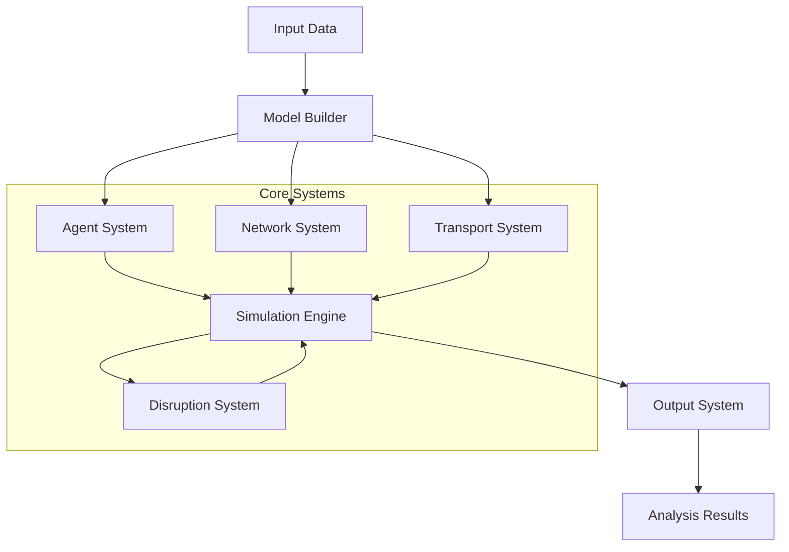
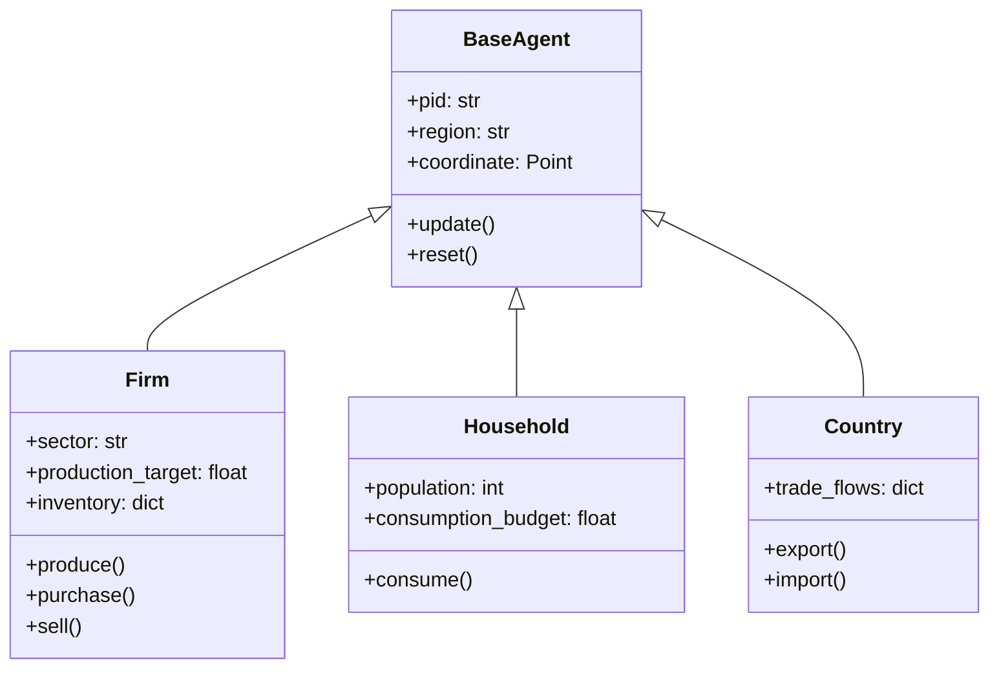
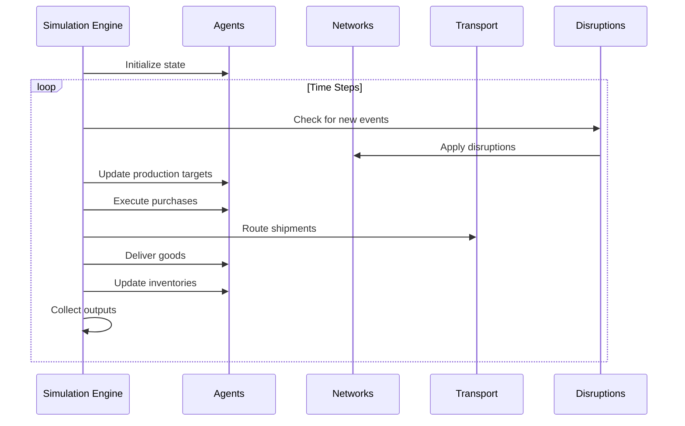
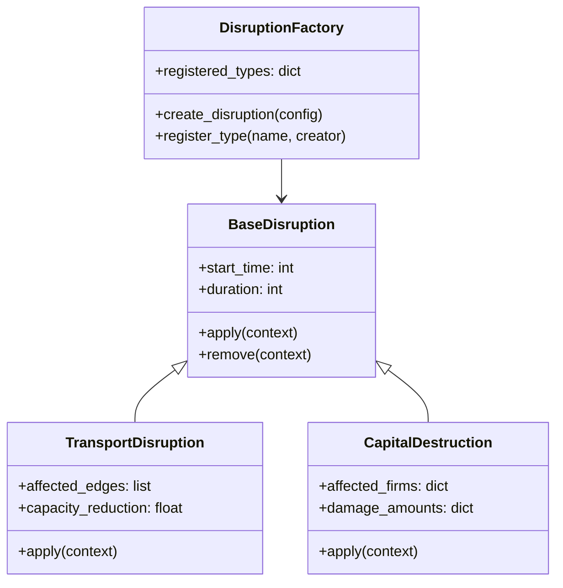
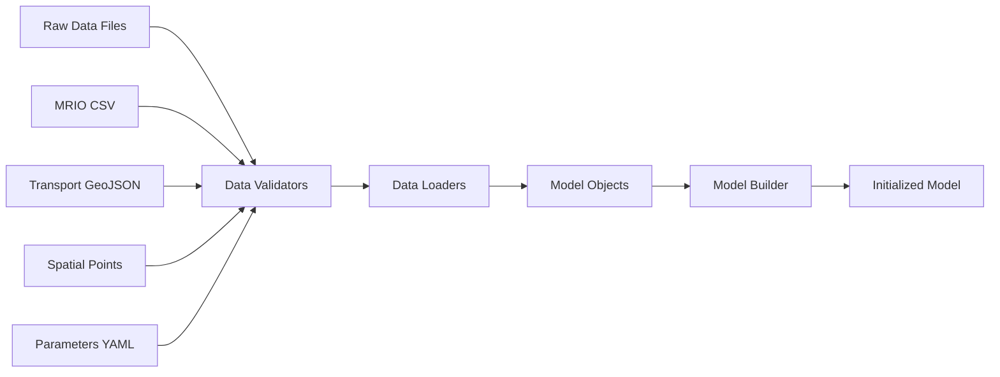
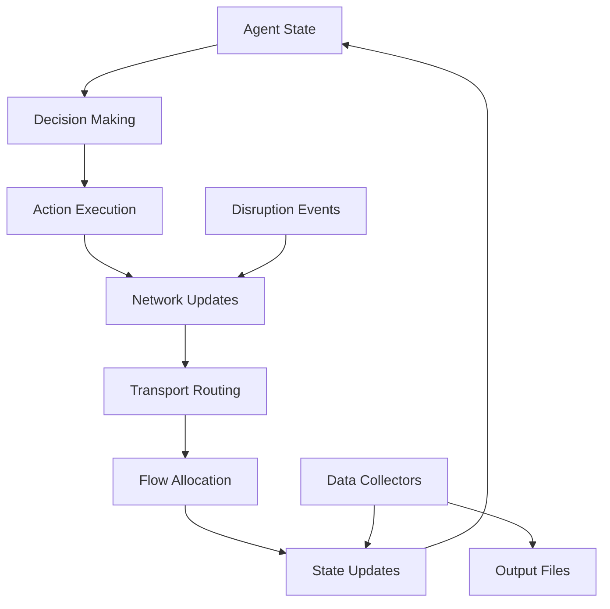

# Architecture Overview

DisruptSC is a spatial agent-based model designed to simulate supply chain disruptions and their economic impacts. This section explains the model's architecture, core components, and design patterns.

## Model Philosophy

DisruptSC follows these core principles:

- **Agent-based modeling** - Economic actors (firms, households, countries) are modeled as autonomous agents
- **Spatial representation** - All agents and infrastructure are geo-located for realistic modeling
- **Network-based interactions** - Supply chains and transport are modeled as interconnected networks  
- **Data-driven parameterization** - Model uses real economic and geographic data
- **Modular design** - Components can be extended or replaced independently

## High-Level Architecture



## Core Components

### 1. Data Layer

**Purpose**: Manage input data and provide consistent access

**Key Classes**:
- `Mrio` - Multi-regional input-output tables (extends pandas DataFrame)
- `Parameters` - Configuration management
- `Paths` - Data path resolution

**Data Types**:
- Economic data (MRIO, sector tables, firm data)
- Transport networks (roads, maritime, railways)  
- Spatial data (agent locations, administrative boundaries)

### 2. Agent System

**Purpose**: Represent economic actors and their behaviors

**Agent Types**:



**Key Features**:
- **Autonomous behavior** - Each agent makes independent decisions
- **Spatial awareness** - Agents know their location and can interact spatially
- **Memory** - Agents maintain state across time steps
- **Adaptability** - Agents can adjust behavior based on conditions

### 3. Network System

**Purpose**: Model relationships and flows between agents

**Network Types**:

#### Supply Chain Network (`ScNetwork`)
- Extends NetworkX DiGraph
- Nodes: Economic agents (firms, households, countries)
- Edges: Commercial relationships with flow volumes
- Weights: Relationship strength, geographic distance

#### Transport Network (`TransportNetwork`)  
- Spatial graph of infrastructure
- Nodes: Geographic locations, ports, border crossings
- Edges: Roads, maritime routes, railways
- Attributes: Capacity, speed, costs

#### Multi-Regional Input-Output Network
- Economic interdependencies between sectors
- Technical coefficients define input requirements
- Final demand drives the system

### 4. Simulation Engine

**Purpose**: Orchestrate model execution and time progression

**Execution Flow**:



**Key Features**:
- **Discrete time steps** - Day/week/month resolution
- **Event-driven** - Disruptions trigger at specified times
- **State management** - Consistent agent and network state
- **Data collection** - Comprehensive output tracking

### 5. Disruption System

**Purpose**: Model various types of supply chain disruptions

**Architecture**:



**Disruption Types**:
- **Transport disruptions** - Road/port closures, capacity reductions
- **Capital destruction** - Damage to production facilities
- **Supply disruptions** - Supplier failures, trade restrictions
- **Demand shocks** - Changes in consumer demand

## Data Flow Architecture

### Input Processing



### Simulation Data Flow



## Component Interactions

### Model Initialization

1. **Data Loading**: Read and validate all input files
2. **Network Construction**: Build transport and supply chain networks
3. **Agent Creation**: Generate agents based on economic and spatial data
4. **Routing Calculation**: Pre-compute optimal transport routes
5. **Equilibrium**: Establish baseline economic equilibrium

### Runtime Interactions

1. **Event Processing**: Check for disruption events
2. **Production Planning**: Firms set production targets
3. **Purchasing**: Agents place orders with suppliers
4. **Transport Planning**: Route shipments through network
5. **Delivery**: Execute transport and update inventories
6. **Market Clearing**: Balance supply and demand

## Design Patterns

### Factory Pattern
Used for creating disruptions dynamically based on configuration:

```python
class DisruptionFactory:
    _creators = {}
    
    @classmethod
    def register(cls, disruption_type, creator_func):
        cls._creators[disruption_type] = creator_func
    
    @classmethod
    def create(cls, config):
        disruption_type = config['type']
        creator = cls._creators[disruption_type]
        return creator(config)
```

### Builder Pattern
Model construction is complex and uses builders:

```python
class ModelBuilder:
    def __init__(self, parameters):
        self.parameters = parameters
        
    def build_transport_network(self):
        # Complex network construction
        pass
        
    def build_agents(self):
        # Agent creation from data
        pass
        
    def build_supply_chains(self):
        # Network relationship creation
        pass
```

### Observer Pattern
Data collection observes simulation state:

```python
class DataCollector:
    def __init__(self):
        self.observers = []
    
    def notify(self, event_type, data):
        for observer in self.observers:
            observer.update(event_type, data)
```

## Performance Considerations

### Computational Complexity

| Component | Complexity | Bottlenecks |
|-----------|------------|-------------|
| **Agent Updates** | O(n) | Large agent populations |
| **Network Routing** | O(n log n) | Complex transport networks |
| **Flow Allocation** | O(n²) | Dense supply chain networks |
| **Spatial Queries** | O(log n) | Geographic lookups |

### Memory Management

- **Caching**: Expensive computations (routing, distances) are cached
- **Lazy Loading**: Data loaded only when needed
- **State Management**: Minimal agent state to reduce memory
- **Batch Processing**: Large operations processed in batches

### Scalability Strategies

1. **Hierarchical Networks**: Reduce network complexity through aggregation
2. **Spatial Indexing**: Efficient geographic queries
3. **Parallel Processing**: Multi-threaded routing and agent updates
4. **Incremental Updates**: Only update changed components

## Extension Points

### Adding New Agent Types

```python
class NewAgentType(BaseAgent):
    def __init__(self, pid, **kwargs):
        super().__init__(pid, **kwargs)
        # Custom initialization
        
    def update(self, t, **kwargs):
        # Custom behavior
        super().update(t, **kwargs)
```

### Custom Disruption Types

```python
def create_custom_disruption(config, context):
    return CustomDisruption(
        start_time=config['start_time'],
        custom_param=config['custom_param']
    )

DisruptionFactory.register('custom_type', create_custom_disruption)
```

### New Transport Modes

```python
class CustomTransportMode:
    def calculate_cost(self, distance, volume):
        # Custom cost calculation
        pass
        
    def calculate_time(self, distance, conditions):
        # Custom time calculation  
        pass
```

## Validation and Testing

### Input Validation
- **Schema validation** - Check file formats and structures
- **Data consistency** - Verify cross-file relationships
- **Range validation** - Ensure realistic parameter values
- **Network validation** - Check connectivity and topology

### Model Validation
- **Mass balance** - Economic flows balance at each node
- **Spatial consistency** - Geographic relationships are realistic
- **Temporal consistency** - State transitions are valid
- **Behavioral validation** - Agent actions are reasonable

### Performance Testing
- **Scalability tests** - Performance with increasing model size
- **Memory profiling** - Track memory usage patterns
- **Benchmarking** - Compare performance across versions

## Future Architecture Considerations

### Planned Enhancements

1. **Microservices Architecture** - Decompose into independent services
2. **Stream Processing** - Real-time disruption handling
3. **Cloud Deployment** - Distributed computing capabilities
4. **API Layer** - REST/GraphQL interfaces for external integration

### Emerging Technologies

1. **Machine Learning Integration** - Predictive agent behaviors
2. **Graph Databases** - More efficient network storage
3. **Distributed Computing** - Spark/Dask integration
4. **Containerization** - Docker-based deployment