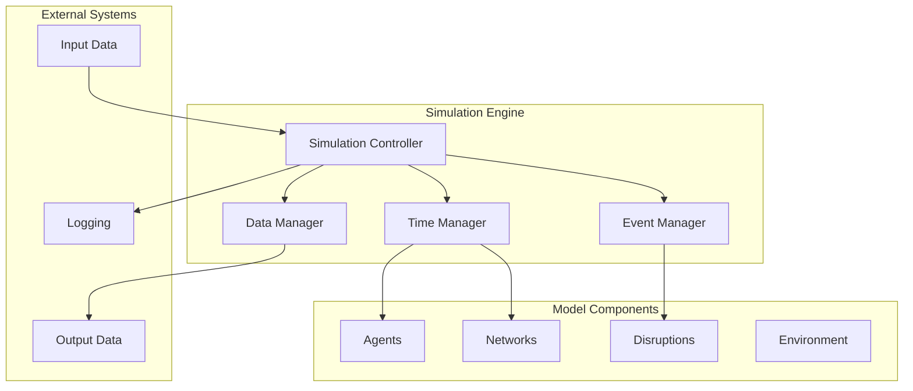
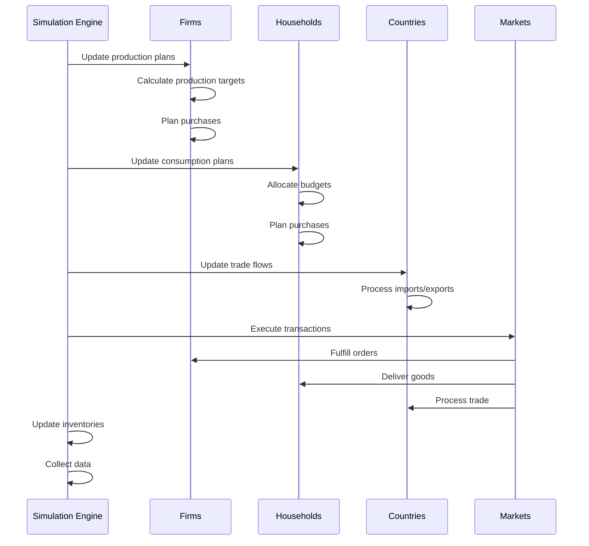

# Simulation Engine

The simulation engine orchestrates the execution of DisruptSC models, managing time progression, agent interactions, and data collection. This document explains the simulation architecture, execution flow, and key components.

## Simulation Architecture

### Core Components



### Simulation Controller

The main simulation controller manages the overall execution:

```python
class Simulation:
    """Main simulation controller for DisruptSC."""
    
    def __init__(self, model, parameters):
        self.model = model
        self.parameters = parameters
        self.current_time = 0
        self.max_time = parameters.t_final
        
        # Core managers
        self.time_manager = TimeManager(parameters.time_resolution)
        self.event_manager = EventManager()
        self.data_manager = DataManager(parameters.output_config)
        self.disruption_controller = DisruptionController(parameters.events)
        
        # State tracking
        self.simulation_state = SimulationState()
        self.convergence_checker = ConvergenceChecker()
        self.performance_monitor = PerformanceMonitor()
        
    def run(self):
        """Execute the complete simulation."""
        
        logger.info("Starting simulation")
        self.performance_monitor.start()
        
        try:
            # Initialize simulation
            self.initialize()
            
            # Main simulation loop
            while self.should_continue():
                self.execute_time_step()
                self.current_time += 1
            
            # Finalize simulation
            self.finalize()
            
        except Exception as e:
            logger.error(f"Simulation failed: {e}")
            raise
        finally:
            self.performance_monitor.stop()
            logger.info(f"Simulation completed in {self.performance_monitor.elapsed_time:.2f} seconds")
    
    def should_continue(self) -> bool:
        """Check if simulation should continue."""
        
        # Time limit check
        if self.current_time >= self.max_time:
            return False
        
        # Convergence check (for equilibrium simulations)
        if self.parameters.epsilon_stop_condition:
            if self.convergence_checker.has_converged(self.simulation_state):
                logger.info(f"Simulation converged at time {self.current_time}")
                return False
        
        # Early termination conditions
        if self.simulation_state.should_terminate():
            logger.info(f"Early termination at time {self.current_time}")
            return False
        
        return True
```

## Time Management

### Time Resolution

DisruptSC supports multiple time resolutions:

```python
class TimeManager:
    """Manage simulation time and temporal operations."""
    
    def __init__(self, time_resolution: str):
        self.resolution = time_resolution
        self.resolution_mapping = {
            'day': 1,
            'week': 7,
            'month': 30,
            'quarter': 90,
            'year': 365
        }
        
        if time_resolution not in self.resolution_mapping:
            raise ValueError(f"Invalid time resolution: {time_resolution}")
        
        self.days_per_step = self.resolution_mapping[time_resolution]
    
    def convert_to_simulation_time(self, real_time_days: float) -> int:
        """Convert real time (days) to simulation time steps."""
        return int(real_time_days / self.days_per_step)
    
    def convert_to_real_time(self, simulation_steps: int) -> float:
        """Convert simulation time steps to real time (days)."""
        return simulation_steps * self.days_per_step
    
    def get_temporal_weights(self, t: int) -> dict:
        """Get temporal weights for seasonal/cyclical effects."""
        
        # Convert to day of year
        day_of_year = (t * self.days_per_step) % 365
        
        # Seasonal weights (example: agriculture seasonality)
        seasonal_weight = 1.0 + 0.3 * np.sin(2 * np.pi * day_of_year / 365)
        
        return {
            'seasonal': seasonal_weight,
            'trend': 1.0,  # Long-term trend factor
            'cyclical': 1.0  # Business cycle factor
        }
```

### Temporal Scheduling

```python
class EventScheduler:
    """Schedule and manage time-based events."""
    
    def __init__(self):
        self.scheduled_events = {}  # {time: [events]}
        self.recurring_events = []
        
    def schedule_event(self, time: int, event: callable, **kwargs):
        """Schedule event at specific time."""
        if time not in self.scheduled_events:
            self.scheduled_events[time] = []
        
        self.scheduled_events[time].append({
            'function': event,
            'kwargs': kwargs
        })
    
    def schedule_recurring(self, start_time: int, interval: int, event: callable, **kwargs):
        """Schedule recurring event."""
        self.recurring_events.append({
            'start_time': start_time,
            'interval': interval,
            'function': event,
            'kwargs': kwargs,
            'last_execution': start_time - interval
        })
    
    def execute_scheduled_events(self, t: int):
        """Execute all events scheduled for time t."""
        
        # Execute one-time events
        if t in self.scheduled_events:
            for event in self.scheduled_events[t]:
                try:
                    event['function'](**event['kwargs'])
                except Exception as e:
                    logger.error(f"Event execution failed at time {t}: {e}")
            
            del self.scheduled_events[t]
        
        # Execute recurring events
        for event in self.recurring_events:
            if (t >= event['start_time'] and 
                (t - event['last_execution']) >= event['interval']):
                
                try:
                    event['function'](**event['kwargs'])
                    event['last_execution'] = t
                except Exception as e:
                    logger.error(f"Recurring event execution failed at time {t}: {e}")
```

## Execution Flow

### Time Step Execution

```python
def execute_time_step(self):
    """Execute single simulation time step."""
    
    t = self.current_time
    logger.debug(f"Executing time step {t}")
    
    # 1. Update temporal environment
    self.update_environment(t)
    
    # 2. Process scheduled events
    self.event_manager.execute_scheduled_events(t)
    
    # 3. Update disruptions
    self.disruption_controller.update(t, self.get_disruption_context())
    
    # 4. Agent decision making
    self.execute_agent_decisions(t)
    
    # 5. Execute agent actions
    self.execute_agent_actions(t)
    
    # 6. Update networks and flows
    self.update_networks(t)
    
    # 7. Market clearing and equilibration
    self.clear_markets(t)
    
    # 8. Data collection
    self.data_manager.collect_data(t, self.simulation_state)
    
    # 9. Update simulation state
    self.simulation_state.update(t, self.model)
```

### Agent Decision Sequence



### Production and Consumption Cycle

```python
def execute_agent_decisions(self, t: int):
    """Execute agent decision-making phase."""
    
    # 1. Firms update production targets
    self.update_firm_production_plans(t)
    
    # 2. Households update consumption plans
    self.update_household_consumption_plans(t)
    
    # 3. Countries update trade flows
    self.update_country_trade_plans(t)

def execute_agent_actions(self, t: int):
    """Execute agent actions phase."""
    
    # 1. Firms place orders with suppliers
    self.execute_firm_purchasing(t)
    
    # 2. Households place orders with retailers
    self.execute_household_purchasing(t)
    
    # 3. Process and route shipments
    self.execute_transport_planning(t)
    
    # 4. Execute production
    self.execute_firm_production(t)
    
    # 5. Deliver goods and update inventories
    self.execute_deliveries(t)

def update_firm_production_plans(self, t: int):
    """Update production plans for all firms."""
    
    for firm in self.model.agents.firms.values():
        try:
            # Update demand forecast
            firm.update_demand_forecast(t)
            
            # Check inventory levels
            firm.update_inventory_targets(t)
            
            # Set production target
            firm.set_production_target(t)
            
            # Update capacity utilization
            firm.update_capacity_utilization(t)
            
        except Exception as e:
            logger.error(f"Failed to update firm {firm.pid} production plan: {e}")
```

## Market Clearing

### Supply-Demand Matching

```python
class MarketClearingMechanism:
    """Handle supply-demand matching and price formation."""
    
    def __init__(self, price_adjustment_rate: float = 0.1):
        self.price_adjustment_rate = price_adjustment_rate
        self.market_prices = {}
        self.excess_demand = {}
        
    def clear_markets(self, t: int, agents: AgentCollection):
        """Clear all markets and adjust prices."""
        
        # Collect supply and demand by product
        market_state = self.collect_market_state(agents)
        
        # Match supply and demand
        for product, state in market_state.items():
            self.clear_single_market(product, state, t)
    
    def clear_single_market(self, product: str, market_state: dict, t: int):
        """Clear individual product market."""
        
        total_supply = market_state['supply']
        total_demand = market_state['demand']
        suppliers = market_state['suppliers']
        buyers = market_state['buyers']
        
        # Calculate excess demand
        excess_demand = total_demand - total_supply
        self.excess_demand[product] = excess_demand
        
        if excess_demand > 0:
            # Shortage: ration supply among buyers
            self.ration_supply(product, suppliers, buyers, total_supply)
            # Increase price
            self.adjust_price(product, 1 + self.price_adjustment_rate)
            
        elif excess_demand < 0:
            # Surplus: allocate all demand
            self.allocate_surplus(product, suppliers, buyers, total_demand)
            # Decrease price
            self.adjust_price(product, 1 - self.price_adjustment_rate)
            
        else:
            # Equilibrium: match exactly
            self.match_equilibrium(product, suppliers, buyers)
    
    def ration_supply(self, product: str, suppliers: list, buyers: list, available_supply: float):
        """Ration limited supply among buyers."""
        
        total_demand = sum(buyer.get_demand(product) for buyer in buyers)
        
        if total_demand <= 0:
            return
        
        # Proportional rationing
        for buyer in buyers:
            buyer_demand = buyer.get_demand(product)
            allocated_share = (buyer_demand / total_demand) * available_supply
            buyer.receive_allocation(product, allocated_share)
            
        # Allocate supply among suppliers
        total_supplier_capacity = sum(supplier.get_available_supply(product) for supplier in suppliers)
        
        for supplier in suppliers:
            supplier_capacity = supplier.get_available_supply(product)
            supplier_share = (supplier_capacity / total_supplier_capacity) * available_supply
            supplier.allocate_production(product, supplier_share)
```

### Price Formation

```python
class PriceFormation:
    """Handle price formation and adjustment mechanisms."""
    
    def __init__(self, base_prices: dict):
        self.base_prices = base_prices.copy()
        self.current_prices = base_prices.copy()
        self.price_history = {product: [price] for product, price in base_prices.items()}
        
    def update_prices(self, market_conditions: dict):
        """Update prices based on market conditions."""
        
        for product, conditions in market_conditions.items():
            # Get current market state
            excess_demand_ratio = conditions.get('excess_demand_ratio', 0)
            inventory_levels = conditions.get('inventory_levels', 1.0)
            competition_factor = conditions.get('competition_factor', 1.0)
            
            # Calculate price adjustment
            price_change = self.calculate_price_change(
                excess_demand_ratio, 
                inventory_levels, 
                competition_factor
            )
            
            # Apply adjustment
            old_price = self.current_prices[product]
            new_price = old_price * (1 + price_change)
            
            # Price bounds (prevent extreme prices)
            min_price = self.base_prices[product] * 0.1
            max_price = self.base_prices[product] * 10.0
            new_price = max(min_price, min(max_price, new_price))
            
            self.current_prices[product] = new_price
            self.price_history[product].append(new_price)
    
    def calculate_price_change(self, excess_demand_ratio: float, 
                             inventory_levels: float, 
                             competition_factor: float) -> float:
        """Calculate price change based on market factors."""
        
        # Base adjustment from excess demand
        demand_adjustment = 0.1 * excess_demand_ratio
        
        # Inventory adjustment (low inventory -> higher prices)
        inventory_adjustment = -0.05 * (inventory_levels - 1.0)
        
        # Competition adjustment (more competition -> lower prices)
        competition_adjustment = -0.02 * (competition_factor - 1.0)
        
        total_adjustment = demand_adjustment + inventory_adjustment + competition_adjustment
        
        # Dampen extreme adjustments
        return np.tanh(total_adjustment)
```

## Transport and Logistics

### Shipment Planning

```python
class LogisticsManager:
    """Manage transport planning and shipment execution."""
    
    def __init__(self, transport_network, routing_algorithm='shortest_path'):
        self.transport_network = transport_network
        self.routing_algorithm = routing_algorithm
        self.shipment_queue = []
        self.active_shipments = []
        
    def plan_shipments(self, t: int, purchase_orders: list):
        """Plan shipments for all purchase orders."""
        
        for order in purchase_orders:
            try:
                shipment = self.create_shipment(order, t)
                if shipment:
                    self.shipment_queue.append(shipment)
            except Exception as e:
                logger.error(f"Failed to plan shipment for order {order.id}: {e}")
    
    def create_shipment(self, order: PurchaseOrder, t: int) -> Shipment:
        """Create shipment for purchase order."""
        
        # Get origin and destination
        origin = order.supplier.transport_node
        destination = order.buyer.transport_node
        
        # Calculate route
        route = self.calculate_route(origin, destination, order.product)
        
        if not route:
            logger.warning(f"No route found from {origin} to {destination}")
            return None
        
        # Calculate transport costs and time
        transport_cost = self.calculate_transport_cost(route, order.volume)
        transport_time = self.calculate_transport_time(route, order.product)
        
        # Create shipment
        shipment = Shipment(
            order_id=order.id,
            route=route,
            volume=order.volume,
            value=order.value,
            product=order.product,
            departure_time=t,
            arrival_time=t + transport_time,
            transport_cost=transport_cost
        )
        
        return shipment
    
    def execute_shipments(self, t: int):
        """Execute shipment movements and deliveries."""
        
        # Start new shipments
        new_shipments = [s for s in self.shipment_queue if s.departure_time == t]
        for shipment in new_shipments:
            self.start_shipment(shipment)
            self.active_shipments.append(shipment)
            self.shipment_queue.remove(shipment)
        
        # Update active shipments
        completed_shipments = []
        for shipment in self.active_shipments:
            shipment.update(t)
            
            if shipment.is_completed():
                self.complete_delivery(shipment, t)
                completed_shipments.append(shipment)
        
        # Remove completed shipments
        for shipment in completed_shipments:
            self.active_shipments.remove(shipment)
```

### Route Optimization

```python
class RouteOptimizer:
    """Optimize routes considering multiple factors."""
    
    def __init__(self, transport_network):
        self.network = transport_network
        self.route_cache = {}
        
    def find_optimal_route(self, origin: str, destination: str, 
                          cargo_type: str, preferences: dict) -> list:
        """Find optimal route considering multiple criteria."""
        
        # Check cache
        cache_key = (origin, destination, cargo_type)
        if cache_key in self.route_cache:
            return self.route_cache[cache_key]
        
        # Get cargo constraints
        constraints = self.get_cargo_constraints(cargo_type)
        
        # Generate candidate routes
        candidates = self.generate_candidate_routes(origin, destination, constraints)
        
        # Evaluate routes
        best_route = self.evaluate_routes(candidates, preferences, constraints)
        
        # Cache result
        self.route_cache[cache_key] = best_route
        
        return best_route
    
    def evaluate_routes(self, candidates: list, preferences: dict, constraints: dict) -> list:
        """Evaluate and select best route from candidates."""
        
        route_scores = []
        
        for route in candidates:
            # Calculate route metrics
            total_cost = self.calculate_route_cost(route)
            total_time = self.calculate_route_time(route)
            reliability = self.calculate_route_reliability(route)
            
            # Check constraints
            if not self.satisfies_constraints(route, constraints):
                continue
            
            # Calculate weighted score
            score = (
                preferences.get('cost_weight', 0.4) * (1 / total_cost) +
                preferences.get('time_weight', 0.4) * (1 / total_time) +
                preferences.get('reliability_weight', 0.2) * reliability
            )
            
            route_scores.append((route, score))
        
        if not route_scores:
            return None
        
        # Return best route
        route_scores.sort(key=lambda x: x[1], reverse=True)
        return route_scores[0][0]
```

## Data Collection

### Simulation State

```python
class SimulationState:
    """Track and manage simulation state."""
    
    def __init__(self):
        self.agent_states = {}
        self.network_states = {}
        self.economic_indicators = {}
        self.disruption_impacts = {}
        self.convergence_metrics = {}
        
    def update(self, t: int, model):
        """Update simulation state at time t."""
        
        # Collect agent states
        self.agent_states[t] = self.collect_agent_states(model.agents)
        
        # Collect network states
        self.network_states[t] = self.collect_network_states(model.networks)
        
        # Calculate economic indicators
        self.economic_indicators[t] = self.calculate_economic_indicators(model)
        
        # Assess disruption impacts
        if hasattr(model, 'disruption_controller'):
            self.disruption_impacts[t] = self.assess_disruption_impacts(model)
        
        # Update convergence metrics
        self.convergence_metrics[t] = self.calculate_convergence_metrics()
    
    def collect_agent_states(self, agents: AgentCollection) -> dict:
        """Collect current state of all agents."""
        
        state = {
            'firms': {},
            'households': {},
            'countries': {}
        }
        
        # Firm states
        for firm_id, firm in agents.firms.items():
            state['firms'][firm_id] = {
                'production': firm.production_current,
                'production_target': firm.production_target,
                'inventory': firm.inventory.copy(),
                'finance': firm.finance,
                'utilization': firm.capacity_utilization
            }
        
        # Household states
        for hh_id, household in agents.households.items():
            state['households'][hh_id] = {
                'consumption': household.consumption_actual.copy(),
                'consumption_target': household.consumption_targets.copy(),
                'budget': household.consumption_budget,
                'satisfaction': household.calculate_satisfaction()
            }
        
        # Country states
        for country_id, country in agents.countries.items():
            state['countries'][country_id] = {
                'imports': country.import_flows.copy(),
                'exports': country.export_flows.copy(),
                'trade_balance': country.calculate_trade_balance()
            }
        
        return state
```

### Performance Monitoring

```python
class PerformanceMonitor:
    """Monitor simulation performance and resource usage."""
    
    def __init__(self):
        self.start_time = None
        self.memory_usage = []
        self.execution_times = {}
        self.checkpoint_times = {}
        
    def start(self):
        """Start performance monitoring."""
        self.start_time = time.time()
        self.memory_usage = []
        
    def checkpoint(self, name: str):
        """Record performance checkpoint."""
        current_time = time.time()
        self.checkpoint_times[name] = current_time
        
        # Record memory usage
        import psutil
        memory_mb = psutil.Process().memory_info().rss / 1024 / 1024
        self.memory_usage.append((current_time - self.start_time, memory_mb))
    
    def time_function(self, func_name: str, func: callable, *args, **kwargs):
        """Time function execution."""
        start_time = time.time()
        result = func(*args, **kwargs)
        end_time = time.time()
        
        if func_name not in self.execution_times:
            self.execution_times[func_name] = []
        
        self.execution_times[func_name].append(end_time - start_time)
        
        return result
    
    def get_performance_summary(self) -> dict:
        """Get performance summary."""
        
        total_time = time.time() - self.start_time if self.start_time else 0
        peak_memory = max(memory for _, memory in self.memory_usage) if self.memory_usage else 0
        
        avg_execution_times = {
            func_name: np.mean(times) 
            for func_name, times in self.execution_times.items()
        }
        
        return {
            'total_execution_time': total_time,
            'peak_memory_mb': peak_memory,
            'average_execution_times': avg_execution_times,
            'checkpoints': self.checkpoint_times.copy()
        }
```

## Convergence and Equilibrium

### Convergence Detection

```python
class ConvergenceChecker:
    """Check for simulation convergence to equilibrium."""
    
    def __init__(self, tolerance: float = 1e-6, min_steps: int = 10):
        self.tolerance = tolerance
        self.min_steps = min_steps
        self.history_length = 20
        self.metric_history = {}
        
    def has_converged(self, simulation_state: SimulationState) -> bool:
        """Check if simulation has converged."""
        
        # Need minimum steps before checking convergence
        if len(simulation_state.economic_indicators) < self.min_steps:
            return False
        
        # Calculate convergence metrics
        convergence_metrics = self.calculate_convergence_metrics(simulation_state)
        
        # Check each metric
        for metric_name, values in convergence_metrics.items():
            if not self.is_metric_converged(metric_name, values):
                return False
        
        return True
    
    def calculate_convergence_metrics(self, simulation_state: SimulationState) -> dict:
        """Calculate metrics for convergence checking."""
        
        recent_indicators = list(simulation_state.economic_indicators.values())[-self.history_length:]
        
        metrics = {}
        
        # Total production convergence
        total_production = [indicators.get('total_production', 0) for indicators in recent_indicators]
        metrics['total_production'] = total_production
        
        # Price convergence
        if 'average_prices' in recent_indicators[0]:
            avg_prices = [indicators['average_prices'] for indicators in recent_indicators]
            metrics['average_prices'] = avg_prices
        
        # Inventory convergence
        if 'total_inventory' in recent_indicators[0]:
            total_inventory = [indicators['total_inventory'] for indicators in recent_indicators]
            metrics['total_inventory'] = total_inventory
        
        return metrics
    
    def is_metric_converged(self, metric_name: str, values: list) -> bool:
        """Check if specific metric has converged."""
        
        if len(values) < 5:  # Need minimum values
            return False
        
        # Calculate relative change over last few steps
        recent_values = values[-5:]
        relative_changes = []
        
        for i in range(1, len(recent_values)):
            if recent_values[i-1] != 0:
                rel_change = abs((recent_values[i] - recent_values[i-1]) / recent_values[i-1])
                relative_changes.append(rel_change)
        
        if not relative_changes:
            return True
        
        # Check if all recent changes are below tolerance
        max_change = max(relative_changes)
        return max_change < self.tolerance
```

## Error Handling and Recovery

### Simulation Recovery

```python
class SimulationRecovery:
    """Handle simulation errors and recovery."""
    
    def __init__(self, checkpoint_interval: int = 10):
        self.checkpoint_interval = checkpoint_interval
        self.checkpoints = {}
        self.error_count = 0
        self.max_errors = 5
        
    def save_checkpoint(self, t: int, simulation_state: SimulationState):
        """Save simulation checkpoint."""
        
        if t % self.checkpoint_interval == 0:
            checkpoint_data = {
                'time': t,
                'state': copy.deepcopy(simulation_state),
                'timestamp': time.time()
            }
            self.checkpoints[t] = checkpoint_data
            
            # Keep only recent checkpoints
            if len(self.checkpoints) > 10:
                oldest_time = min(self.checkpoints.keys())
                del self.checkpoints[oldest_time]
    
    def handle_simulation_error(self, t: int, error: Exception, simulation: 'Simulation'):
        """Handle simulation error and attempt recovery."""
        
        logger.error(f"Simulation error at time {t}: {error}")
        self.error_count += 1
        
        if self.error_count > self.max_errors:
            logger.error("Too many errors, terminating simulation")
            raise SimulationFailedException("Maximum error count exceeded")
        
        # Try to recover from checkpoint
        recovery_time = self.find_recovery_checkpoint(t)
        
        if recovery_time is not None:
            logger.info(f"Recovering from checkpoint at time {recovery_time}")
            self.restore_checkpoint(recovery_time, simulation)
            return recovery_time
        else:
            logger.error("No suitable checkpoint found for recovery")
            raise error
    
    def restore_checkpoint(self, checkpoint_time: int, simulation: 'Simulation'):
        """Restore simulation from checkpoint."""
        
        checkpoint = self.checkpoints[checkpoint_time]
        simulation.current_time = checkpoint_time
        simulation.simulation_state = checkpoint['state']
        
        # Reset any accumulated errors
        self.error_count = max(0, self.error_count - 1)
```

## Testing and Validation

### Simulation Testing

```python
def test_simulation_execution():
    """Test basic simulation execution."""
    
    # Create test model
    model = create_test_model()
    parameters = create_test_parameters()
    
    # Create simulation
    simulation = Simulation(model, parameters)
    
    # Run short simulation
    simulation.max_time = 5
    simulation.run()
    
    # Verify execution
    assert simulation.current_time == 5
    assert len(simulation.simulation_state.economic_indicators) == 5
    
def test_convergence_detection():
    """Test convergence detection."""
    
    checker = ConvergenceChecker(tolerance=1e-6)
    
    # Create converged state
    state = SimulationState()
    for t in range(20):
        # Stable values
        state.economic_indicators[t] = {
            'total_production': 1000.0,
            'average_prices': 100.0
        }
    
    assert checker.has_converged(state)
    
    # Create non-converged state
    state2 = SimulationState()
    for t in range(20):
        # Changing values
        state2.economic_indicators[t] = {
            'total_production': 1000.0 + t * 10,
            'average_prices': 100.0 + t * 5
        }
    
    assert not checker.has_converged(state2)
```

## Future Enhancements

### Planned Simulation Features

1. **Parallel Simulation** - Multi-threaded agent updates
2. **Adaptive Time Steps** - Variable time resolution during simulation
3. **Real-Time Simulation** - Integration with live data feeds
4. **Interactive Simulation** - User intervention during execution

### Advanced Simulation Capabilities

1. **Machine Learning Integration** - AI-driven agent behaviors
2. **Uncertainty Quantification** - Probabilistic simulation outcomes
3. **Multi-Scale Modeling** - Integration of different temporal scales
4. **Distributed Simulation** - Cloud-based parallel execution