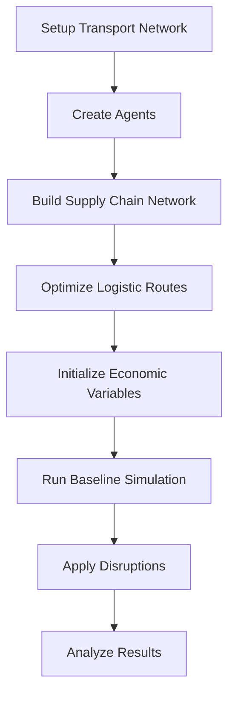

# DisruptSC

DisruptSC is a **spatial agent-based model** for simulating supply chain disruptions. It models economic agents (firms, households, countries) connected through transport networks and supply chains to analyze the impact of disruptions on economic systems.

## Key Features

🌍 **Spatial Modeling**
:   Agents are located on transport networks with realistic geographic constraints

🏭 **Multi-Agent System**
:   Firms, households, and countries with distinct behaviors and interactions

🚛 **Transport Networks**
:   Multiple transport modes (roads, maritime, railways, airways, pipelines)

💼 **Economic Foundations**
:   Based on Multi-Regional Input-Output (MRIO) tables

⚡ **Disruption Analysis**
:   Model transport disruptions and capital destruction events

📊 **Rich Outputs**
:   Detailed economic and spatial results for policy analysis

## Quick Start

!!! tip "New to DisruptSC?"
    
    Start with our [Installation Guide](getting-started/installation.md) and then try the [Quick Start Tutorial](getting-started/quick-start.md).

```bash
# Install dependencies
conda env create -f dsc-environment.yml
conda activate dsc

# Set up data (choose one option)
export DISRUPT_SC_DATA_PATH=/path/to/data  # Option 1: Environment variable
git submodule add <data-repo-url> data     # Option 2: Git submodule

# Validate inputs
python validate_inputs.py Cambodia

# Run a simulation
python disruptsc/main.py Cambodia
```

## Use Cases

**🏛️ Policy Analysis**
:   Assess economic impacts of infrastructure disruptions for policy planning

**🌪️ Disaster Response**
:   Model supply chain vulnerabilities during natural disasters

**🚧 Infrastructure Planning**
:   Evaluate critical transport links and redundancy needs

**📈 Economic Research**
:   Study spatial economic dynamics and regional dependencies

## Model Workflow



## Architecture Overview

DisruptSC uses a modular architecture with clear separation of concerns:

- **[Agents](architecture/agents.md)**: Economic actors with spatial locations and behaviors
- **[Networks](architecture/networks.md)**: Transport infrastructure and supply chain relationships  
- **[Disruptions](architecture/disruptions.md)**: Events that affect agent capabilities or network availability
- **[Simulation](architecture/simulation.md)**: Time-stepped execution with data collection

## Getting Help

📖 **Documentation**
:   Comprehensive guides and API reference in this documentation

🐛 **Issues**
:   Report bugs and request features on [GitHub Issues](https://github.com/worldbank/disrupt-sc/issues)

💬 **Discussions**
:   Ask questions and share insights on [GitHub Discussions](https://github.com/worldbank/disrupt-sc/discussions)

## Citation

If you use DisruptSC in your research, please cite:

```bibtex
@software{disruptsc2024,
  title={DisruptSC: Spatial Agent-Based Model for Supply Chain Disruption Analysis},
  author={Celian Colon},
  year={2024},
  url={https://github.com/ccolon/disrupt-sc}
}
```

## License

DisruptSC is released under the [MIT License](https://github.com/worldbank/disrupt-sc/blob/main/LICENSE).