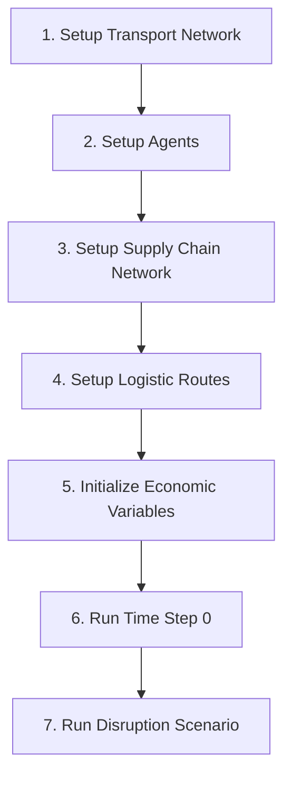

# Basic Usage

This guide covers the command-line interface and basic usage patterns for DisruptSC.

## Command Line Interface

The main entry point for DisruptSC is `disruptsc/main.py`:

```bash
python disruptsc/main.py <scope> [options]
```

### Basic Syntax

```bash
# Basic usage
python disruptsc/main.py <region>

# With caching options  
python disruptsc/main.py <region> --cache <cache_type>

# With custom parameters
python disruptsc/main.py <region> --duration 90 --io_cutoff 0.5
```

### Scope Argument

The `scope` argument specifies the region/case study:

- Must match a data folder: `data/<scope>/` or `input/<scope>/`
- Must have corresponding parameter file: `parameter/user_defined_<scope>.yaml`

**Available scopes:**
- `Cambodia` - Southeast Asian economy
- `ECA` - Europe & Central Asia
- `Ecuador` - South American economy  
- `Global` - World economy
- `Testkistan` - Synthetic test case

### Command Options

#### Caching Options

| Option | Description | Use Case |
|--------|-------------|----------|
| `same_transport_network_new_agents` | Reuse transport network, rebuild agents | Testing agent parameters |
| `same_agents_new_sc_network` | Reuse agents, rebuild supply chain | Testing supplier selection |
| `same_sc_network_new_logistic_routes` | Reuse supply chain, rebuild logistics | Testing transport parameters |
| `same_logistic_routes` | Reuse everything | Running different disruption scenarios |

#### Parameter Overrides

```bash
# Economic parameters
--io_cutoff 0.5                    # Input-output cutoff threshold
--cutoff_firm_output_value 1000000 # Minimum firm output (in model units)
--duration 90                      # Simulation duration (time steps)

# Transport parameters  
--capacity_constraint true          # Enable transport capacity limits
--transport_to_households false     # Disable household transport modeling

# Performance parameters
--sectors_to_include "AGR,MAN"      # Only include specified sectors
--sectors_to_exclude "SER"          # Exclude specified sectors
```

#### Utility Options

```bash
--version                          # Show version information
--help                            # Show help message
--verbose                         # Enable verbose output
--config path/to/config.yaml      # Use custom config file
```

## Simulation Workflow

### Standard Workflow



### Effect of Caching

The `--cache` option determines where the workflow starts:

- **No cache**: Starts at step 1 (full rebuild)
- **`same_transport_network_new_agents`**: Starts at step 2
- **`same_agents_new_sc_network`**: Starts at step 3  
- **`same_sc_network_new_logistic_routes`**: Starts at step 4
- **`same_logistic_routes`**: Starts at step 5

!!! tip "Development Workflow"
    
    Use caching to speed up development:
    
    ```bash
    # Initial run (slow)
    python disruptsc/main.py Cambodia
    
    # Test different agent parameters (faster)
    python disruptsc/main.py Cambodia --cache same_transport_network_new_agents
    
    # Test different disruption scenarios (fastest)
    python disruptsc/main.py Cambodia --cache same_logistic_routes
    ```

## Configuration Files

### Parameter Structure

DisruptSC uses a hierarchical configuration system:

1. **`parameter/default.yaml`** - Base parameters (don't edit)
2. **`parameter/user_defined_<scope>.yaml`** - Scope-specific overrides

### Key Configuration Sections

#### Simulation Settings
```yaml
simulation_type: "initial_state"  # or "disruption", "criticality", etc.
t_final: 365                      # Simulation duration (days)
time_resolution: "day"            # Time unit
```

#### Data Sources
```yaml
firm_data_type: "mrio"            # "mrio" or "supplier-buyer network"
monetary_units_in_model: "mUSD"   # Model currency unit
monetary_units_in_data: "USD"     # Data currency unit
```

#### Economic Parameters
```yaml
io_cutoff: 0.01                   # Input-output coefficient threshold
cutoff_firm_output:
  value: 1000000
  unit: "USD"
cutoff_sector_output:
  value: 50000000  
  unit: "USD"
```

#### Transport Settings
```yaml
with_transport: true              # Enable transport modeling
capacity_constraint: false       # Enable capacity constraints
transport_to_households: false   # Model household transport
```

#### File Paths
```yaml
filepaths:
  mrio: "Economic/mrio.csv"
  sector_table: "Economic/sector_table.csv"
  households_spatial: "Spatial/households.geojson"
  # ... other file paths
```

## Simulation Types

### Initial State Analysis

Analyze baseline equilibrium without disruptions:

```yaml
simulation_type: "initial_state"
```

**Purpose:** Understand normal economic operations
**Output:** Equilibrium flows, agent states, network utilization

### Disruption Simulation

Single disruption scenario:

```yaml
simulation_type: "disruption"
events:
  - type: "transport_disruption"
    # ... disruption configuration
```

**Purpose:** Analyze specific disruption impacts
**Output:** Time series of economic impacts, recovery dynamics

### Monte Carlo Analysis

Multiple disruption realizations:

```yaml
simulation_type: "disruption_mc"
mc_repetitions: 100
events:
  - type: "transport_disruption"
    # ... disruption configuration
```

**Purpose:** Statistical analysis of disruption impacts
**Output:** Distribution of outcomes, confidence intervals

### Criticality Assessment

Systematic infrastructure assessment:

```yaml
simulation_type: "criticality"
criticality:
  duration: 30
  # ... criticality configuration
```

**Purpose:** Identify critical infrastructure links
**Output:** Criticality rankings, vulnerability maps

### Flow Calibration

Calibrate transport flows to observed data:

```yaml
simulation_type: "flow_calibration"
# ... calibration configuration
```

**Purpose:** Match model outputs to empirical data
**Output:** Calibrated parameters, goodness-of-fit metrics

## Data Modes

DisruptSC supports two data input modes:

### MRIO Mode (Default)

```yaml
firm_data_type: "mrio"  # or omit parameter
```

**Data Requirements:**
- Multi-Regional Input-Output table (`Economic/mrio.csv`)
- Sector definitions (`Economic/sector_table.csv`)
- Spatial disaggregation files (`Spatial/*.geojson`)

**Generated:**
- Firms from MRIO output data
- Households from MRIO final demand
- Countries from MRIO trade flows
- Supply chains from technical coefficients

### Supplier-Buyer Network Mode

```yaml
firm_data_type: "supplier-buyer network"
```

**Additional Requirements:**
- Firm data (`Economic/firm_table.csv`)
- Location data (`Economic/location_table.csv`)  
- Transaction data (`Economic/transaction_table.csv`)

**Use Case:** When you have detailed firm-level transaction data

!!! info "Mode Selection"
    
    **Use MRIO mode when:**
    - You have standard economic accounts data
    - Working at regional/national scale
    - Need comprehensive coverage
    
    **Use supplier-buyer mode when:**
    - You have detailed firm transaction data
    - Studying specific supply chains
    - Need micro-level accuracy

## Output Management

### Output Structure

Results are saved to timestamped folders:

```
output/<scope>/<timestamp>/
├── firm_data.json           # Firm state time series
├── household_data.json      # Household data
├── country_data.json        # Country trade data
├── firm_table.geojson       # Firm locations and attributes
├── household_table.geojson  # Household locations
├── transport_edges_with_flows_0.geojson  # Transport flows
├── sc_network_edgelist.csv  # Supply chain network
├── parameters.yaml          # Run configuration
└── exp.log                  # Execution log
```

### Key Output Files

#### Time Series Data
- **`*_data.json`** - Agent state evolution over time
- **`flow_df_*.csv`** - Transport flow data by time step
- **`loss_*.csv`** - Economic loss metrics

#### Spatial Data  
- **`*_table.geojson`** - Agent locations with attributes
- **`transport_edges_with_flows_*.geojson`** - Network flows for visualization

#### Network Data
- **`sc_network_edgelist.csv`** - Supply chain relationships
- **`io_table.csv`** - Input-output flows

#### Metadata
- **`parameters.yaml`** - Complete configuration snapshot
- **`exp.log`** - Detailed execution log with timing and debug info

### Result Analysis

Basic result exploration:

```python
import json
import pandas as pd
import geopandas as gpd

# Load time series data
with open('firm_data.json', 'r') as f:
    firm_data = json.load(f)

# Load spatial results
firms = gpd.read_file('firm_table.geojson')
flows = gpd.read_file('transport_edges_with_flows_0.geojson')

# Analyze production losses
production_loss = pd.DataFrame(firm_data['production']).diff(axis=1)
total_loss = production_loss.sum().sum()
print(f"Total production loss: {total_loss:.2f}")
```

## Best Practices

### Development Workflow

1. **Start small** - Test with `Testkistan` first
2. **Use caching** - Speed up iterative development
3. **Validate inputs** - Always run validation before long simulations
4. **Monitor logs** - Check `exp.log` for issues
5. **Save configurations** - Version control your parameter files

### Performance Optimization

```bash
# Use firm filtering for large models
python disruptsc/main.py Cambodia --cutoff_firm_output_value 5000000

# Exclude service sectors if not needed
python disruptsc/main.py Cambodia --sectors_to_exclude "SER,TRA"

# Disable household transport for faster runs
python disruptsc/main.py Cambodia --transport_to_households false
```

### Production Runs

```bash
# Full validation before production
python validate_inputs.py Cambodia

# Production run with full logging
python disruptsc/main.py Cambodia --verbose > production.log 2>&1

# Archive results with metadata
cp -r output/Cambodia/latest/ results/cambodia_baseline_$(date +%Y%m%d)
```

## Troubleshooting

### Common Issues

!!! failure "Memory errors"
    
    **Solution:** Reduce model size or increase system memory
    ```bash
    python disruptsc/main.py Cambodia --cutoff_firm_output_value 10000000
    ```

!!! failure "Long initialization times"
    
    **Solution:** Use caching for repeated runs
    ```bash
    python disruptsc/main.py Cambodia --cache same_transport_network_new_agents
    ```

!!! failure "Missing data files"
    
    **Solution:** Check data path and file structure
    ```bash
    python validate_inputs.py Cambodia
    ls -la data/Cambodia/Economic/
    ```

### Debug Mode

For detailed debugging:

```bash
# Enable verbose logging
python disruptsc/main.py Cambodia --verbose

# Check execution log
tail -f output/Cambodia/latest/exp.log

# Validate data first
python validate_inputs.py Cambodia --verbose
```