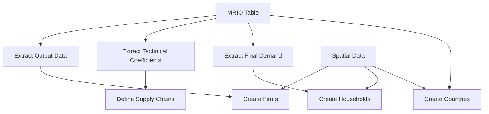
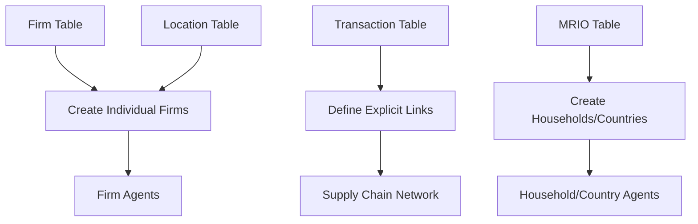
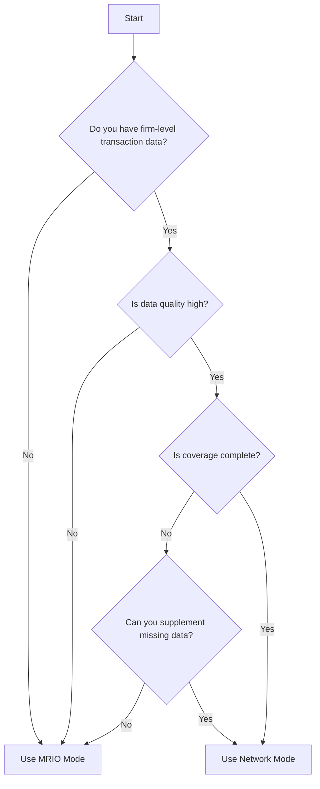

# Data Modes

DisruptSC supports two data input modes for creating economic agents and supply chains. This guide explains when and how to use each mode.

## Overview

| Mode | Data Source | Use Case | Complexity |
|------|-------------|----------|------------|
| **MRIO** | Input-Output tables | Regional/national studies | Simple |
| **Supplier-Buyer Network** | Transaction data | Supply chain studies | Advanced |

## MRIO Mode (Default)

Multi-Regional Input-Output (MRIO) mode uses standard economic accounts data to generate agents and supply chains.

### Configuration

```yaml
# Default - can be omitted
firm_data_type: "mrio"
```

### Data Requirements

#### Required Files
```
data/<scope>/
├── Economic/
│   ├── mrio.csv            # Multi-regional input-output table
│   └── sector_table.csv    # Sector definitions and parameters
└── Spatial/
    ├── households.geojson  # Household spatial distribution
    ├── countries.geojson   # Country/import entry points
    └── firms.geojson       # Firm spatial disaggregation
```

#### MRIO Table Structure

The `mrio.csv` file contains input-output flows:

```csv
region_sector,AGR_Region1,MAN_Region1,SER_Region1,HH_Region1,Export_CHN,...
AGR_Region1,150.5,75.2,25.0,500.0,100.0,...
MAN_Region1,50.0,200.0,150.0,800.0,150.0,...
SER_Region1,25.0,100.0,300.0,600.0,50.0,...
Import_CHN,10.0,50.0,20.0,100.0,0.0,...
...
```

**Key features:**
- Rows = selling sectors, Columns = buying sectors
- Final demand columns (households, exports)
- Import rows for international trade
- Monetary values in consistent units

#### Sector Table Structure

The `sector_table.csv` defines sector characteristics:

```csv
sector,type,output,final_demand,usd_per_ton,share_exporting_firms,supply_data,cutoff
AGR_Region1,agriculture,2000000,500000,950,0.16,ag_prod,3500000
MAN_Region1,manufacturing,5000000,800000,2864,0.45,man_prod,5000000
SER_Region1,service,3000000,600000,0,0.10,ser_emp,2000000
```

**Required columns:**
- `sector` - Region_sector identifier
- `type` - Sector category (agriculture, manufacturing, etc.)
- `output` - Total yearly output (model currency)
- `final_demand` - Total yearly final demand
- `usd_per_ton` - USD value per ton (0 for services)
- `share_exporting_firms` - Fraction of firms that export
- `supply_data` - Spatial disaggregation attribute
- `cutoff` - Minimum threshold for firm creation

### How MRIO Mode Works



#### 1. Firm Creation
- **One firm per region-sector** with non-zero output
- **Spatial disaggregation** based on `firms.geojson` attributes
- **Production capacity** from MRIO output data
- **Input requirements** from technical coefficients

#### 2. Household Creation  
- **Spatial distribution** from `households.geojson`
- **Consumption patterns** from MRIO final demand
- **Population weighting** for disaggregation

#### 3. Country Creation
- **Trade partners** from MRIO import/export data  
- **Entry points** from `countries.geojson`
- **Trade volumes** from international flows

#### 4. Supply Chain Formation
- **Technical coefficients** define input requirements
- **Supplier selection** based on spatial proximity and importance
- **Import/export links** for international trade

### Advantages

✅ **Comprehensive coverage** - All economic sectors included
✅ **Data availability** - Standard economic accounts exist globally  
✅ **Consistent framework** - Based on economic theory
✅ **Regional detail** - Sub-national disaggregation possible
✅ **Simple setup** - Minimal data requirements

### Limitations

❌ **Aggregated view** - Less firm-level detail
❌ **Synthetic supply chains** - Generated, not observed
❌ **Homogeneous firms** - Single firm per region-sector
❌ **Static relationships** - No firm dynamics

### Best Use Cases

- **Regional impact analysis** - Natural disasters, trade shocks
- **Policy evaluation** - Infrastructure investments, regulations
- **Academic research** - Theoretical model applications
- **Baseline studies** - Understanding economic structure

## Supplier-Buyer Network Mode

This mode uses detailed firm-level transaction data to create explicit supply chain networks.

### Configuration

```yaml
firm_data_type: "supplier-buyer network"
```

### Additional Data Requirements

```
data/<scope>/
├── Economic/
│   ├── mrio.csv            # Still required for households/countries
│   ├── sector_table.csv    # Still required for sectors
│   ├── firm_table.csv      # Firm-level data
│   ├── location_table.csv  # Firm locations
│   └── transaction_table.csv  # Supplier-buyer transactions
└── Spatial/
    ├── households.geojson  # Still required
    └── countries.geojson   # Still required
```

#### Firm Table Structure

```csv
id,sector,region,output,employees,importance
1001,AGR_Region1,Region1,500000,50,0.15
1002,AGR_Region1,Region1,750000,75,0.25
1003,MAN_Region1,Region1,2000000,200,0.45
```

#### Location Table Structure

```csv
firm_id,long,lat,transport_node,admin_level1
1001,-104.532,40.123,node_456,State1
1002,-104.445,40.234,node_789,State1
1003,-104.612,40.087,node_234,State2
```

#### Transaction Table Structure

```csv
supplier_id,buyer_id,product_sector,transaction,is_essential
1001,1003,AGR_Region1,150000,true
1002,1003,AGR_Region1,200000,false
1004,1003,MAN_Region2,500000,true
```

### How Network Mode Works



#### 1. Firm Creation
- **Individual firms** from firm table records
- **Heterogeneous characteristics** - size, productivity, location
- **Spatial placement** from location table
- **Realistic firm distribution**

#### 2. Supply Chain Creation
- **Explicit transactions** from transaction table
- **Observed relationships** - actual supplier-buyer pairs
- **Transaction volumes** - real economic flows
- **Essential vs. substitutable** suppliers

#### 3. Household/Country Creation  
- **Still uses MRIO** for households and countries
- **Ensures completeness** of economic system
- **Maintains consistency** with national accounts

### Advantages

✅ **Firm-level detail** - Individual heterogeneous firms
✅ **Observed relationships** - Real supplier-buyer networks
✅ **Realistic behavior** - Based on actual transactions
✅ **Supply chain accuracy** - Explicit network structure
✅ **Firm dynamics** - Can model firm entry/exit

### Limitations

❌ **Data intensive** - Requires detailed firm databases
❌ **Limited availability** - Few countries have this data
❌ **Confidentiality** - Firm data often sensitive
❌ **Complexity** - More difficult to set up and validate
❌ **Partial coverage** - May miss informal sectors

### Best Use Cases

- **Supply chain resilience** - Critical supplier identification
- **Firm-level analysis** - Individual company impacts  
- **Network studies** - Supply chain structure analysis
- **Policy targeting** - Firm-specific interventions

## Mode Comparison

### Data Requirements

| Aspect | MRIO Mode | Network Mode |
|--------|-----------|--------------|
| **Setup complexity** | Simple | Complex |
| **Data availability** | High | Low |
| **Data sensitivity** | Low | High |
| **Preprocessing** | Minimal | Extensive |

### Model Characteristics

| Aspect | MRIO Mode | Network Mode |
|--------|-----------|--------------|
| **Firm representation** | Aggregate | Individual |
| **Supply chains** | Generated | Observed |
| **Heterogeneity** | Low | High |
| **Validation** | Economic accounts | Firm surveys |

### Computational Performance

| Aspect | MRIO Mode | Network Mode |
|--------|-----------|--------------|
| **Model size** | Smaller | Larger |
| **Memory usage** | Lower | Higher |
| **Runtime** | Faster | Slower |
| **Scalability** | Better | Limited |

## Choosing the Right Mode

### Decision Framework



### Use MRIO Mode When:

- **Standard analysis** - Regional impact assessment
- **Data constraints** - Limited access to firm data
- **Academic research** - Theoretical model applications
- **Policy analysis** - Broad economic impacts
- **Initial exploration** - Understanding system structure

### Use Network Mode When:

- **Supply chain focus** - Detailed network analysis
- **Firm-level questions** - Individual company impacts
- **Available data** - Access to transaction databases
- **Validation needs** - Match observed supply chains
- **Advanced analysis** - Network topology studies

## Migration Between Modes

### From MRIO to Network

If you start with MRIO and later obtain firm data:

1. **Keep MRIO files** - Still needed for households/countries
2. **Add firm tables** - Supplement with detailed data
3. **Update configuration** - Change `firm_data_type`
4. **Validate consistency** - Check aggregate matches

### From Network to MRIO

If network data becomes unavailable:

1. **Aggregate firm data** - Create MRIO equivalent
2. **Remove firm tables** - Keep only aggregated data
3. **Update configuration** - Revert to MRIO mode
4. **Verify results** - Compare with network version

## Validation and Quality Checks

### MRIO Mode Validation

```bash
# Check MRIO balance
python validate_inputs.py Cambodia --check-mrio-balance

# Verify sector consistency  
python validate_inputs.py Cambodia --check-sectors

# Spatial consistency
python validate_inputs.py Cambodia --check-spatial
```

### Network Mode Validation

```bash
# Firm data consistency
python validate_inputs.py Cambodia --check-firms

# Transaction completeness
python validate_inputs.py Cambodia --check-transactions

# Network connectivity
python validate_inputs.py Cambodia --check-network
```

### Cross-Mode Comparison

```python
# Compare aggregate results
from disruptsc.validation import compare_modes

results = compare_modes(
    mrio_results='output/Cambodia_mrio/',
    network_results='output/Cambodia_network/'
)
print(results.summary())
```

## Best Practices

### Data Preparation

1. **Start with validation** - Always validate before simulation
2. **Check aggregation** - Ensure consistency between levels
3. **Document sources** - Track data provenance
4. **Version control** - Manage data updates

### Model Development

1. **Begin with MRIO** - Start simple, add complexity
2. **Validate incrementally** - Test each data addition
3. **Compare modes** - Cross-validate when possible
4. **Document assumptions** - Record modeling choices

### Production Use

1. **Choose appropriate mode** - Match to research question
2. **Validate results** - Check against known benchmarks
3. **Sensitivity analysis** - Test parameter variations
4. **Archive configurations** - Preserve reproducibility