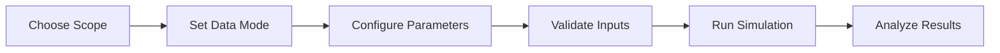

# User Guide

This section provides comprehensive guidance on using DisruptSC for your research and analysis needs.

## Overview

DisruptSC is designed to be flexible and configurable for different use cases. The user guide covers:

- **[Basic Usage](basic-usage.md)** - Command-line interface and simulation types
- **[Parameters](parameters.md)** - Configuration options and settings
- **[Data Modes](data-modes.md)** - MRIO vs Supplier-Buyer network approaches
- **[Input Data](input-data.md)** - Required data files and formats
- **[Output Files](output-files.md)** - Understanding and interpreting results

## Simulation Types

DisruptSC supports several simulation modes:

| Type | Purpose | Use Case |
|------|---------|----------|
| `initial_state` | Baseline equilibrium | Understand normal operations |
| `disruption` | Single disruption scenario | Analyze specific events |
| `disruption_mc` | Monte Carlo analysis | Statistical robustness |
| `criticality` | Infrastructure assessment | Identify critical links |
| `flow_calibration` | Transport calibration | Match observed data |

## Configuration Workflow

## Key Concepts

**Scope**
:   The geographic region of analysis (e.g., Cambodia, Ecuador, Global)

**Regions**
:   Sub-national administrative units within the scope

**Sectors**
:   Economic activity categories based on ISIC/NAICS classifications

**Agents**
:   Economic actors: firms (producers), households (consumers), countries (trade partners)

## Best Practices

!!! tip "Performance Optimization"
    
    - Use caching for repeated runs with `--cache` options
    - Filter small firms/sectors to reduce computational load
    - Consider parallel execution for large-scale analysis

!!! warning "Data Quality"
    
    - Always validate inputs before running simulations
    - Check MRIO table balance and consistency
    - Verify transport network connectivity

!!! info "Reproducibility"
    
    - Save parameter files with your results
    - Document any data preprocessing steps
    - Use version control for configuration changes